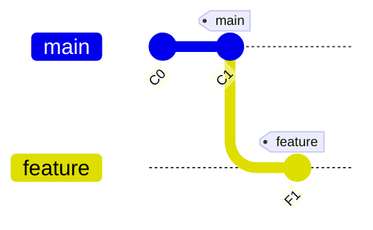
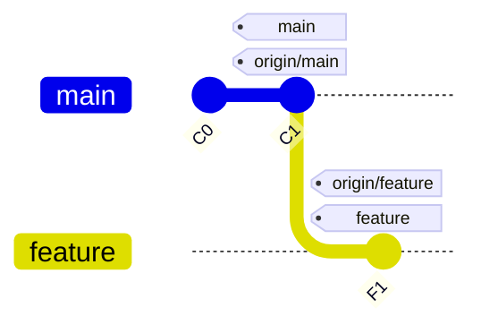

## Project Context:
   - This project is a presentation built using [Slidev](https://sli.dev/).
   - The main slides are in `slides.md`.
   - Components can be found in the `components/` directory, and are made with Vue.
   - The slides are for a Spanish language course on software configuration management and agile development.
   - The Tema 1 is for confguration management, Tema 2 for agile development.
   - For images do not use URLs, use emojis instead.
   - Each slide has limited space, so always prioritize the most important information and be precise.

## Coding Guidelines:
   - The syntax is Markdown, so prioritize using Markdown syntax and slidev directives. If the request cannot be fulfilled with Markdown or built-in slidev directives, use HTML as a fallback.
   - The HTML is styled via UnoCSS which is an Atomic CSS framework similar to Tailwind CSS. You can write HTML inside the markdown and use the UnoCSS classes to style that HTML.
   - Mermaid code cannot be indented.
   - If a two column layout is requested, favor this syntax: <div grid="~ cols-2 gap-2" m="t-5">
   - You can center things with <div class="flex justify-center">...</div>
   - If you are requested to add a note in an absolute position, use the following syntax: <div class="absolute bottom-5 right-5 bg-red-100 border-l-4 border-red-500 text-red-700 p-4 rounded shadow-lg max-w-xs text-sm z-10">. Just change the color and position as the user requests. 
   - For inline code inside another tag do not use backticks, use a code tag.
   - A mermaid diagram can be scaled with this syntax for 80%: ```mermaid {scale:0.8}
   - If you are requested to a definition, use the custom Definicion component, which is used like this: <Definicion title="Mi Título" emoji="📚">Contenido de la definición</Definicion>
   - There is a compact version of the Definicion component called DefinicionCompacta, which is used like this: <DefinicionCompacta title="Mi Título" emoji="📚">Contenido de la definición</DefinicionCompacta>
   - If you are requested to create a slide with an example of the execution of a git command including mermaid git graphs, you can use the custom GitStateComparison component. This is an example of this GitStateComparison for the git clone command:
<GitStateComparison 
  firstColumnTitle="Situación inicial"
  secondColumnTitle="Después de <code>git clone &lt;url&gt;</code>"
  :localBefore="null"
>
  <template #remote-before>

  </template>
  
  <template #remote-after>

  </template>
  
  <template #local-after>

  </template>
</GitStateComparison>
   - If you are requested to create a slide for a git command using the custom <GitCommand> component, make sure to provide all the necessary props: purpose, when, command, and parameters. This is an example of GitCommand for the command git push: 
<GitCommand
  purpose="Envía los commits de tu rama local al repositorio remoto, actualizando la rama remota con tus cambios."
  when="Cuando has realizado commits locales y quieres compartirlos con otros desarrolladores o tener una copia de seguridad en el servidor."
  command="git push &lt;remoto&gt; &lt;rama&gt;"
  :parameters="[
    { 
      name: '&lt;remoto&gt;', 
      description: 'Nombre del repositorio remoto (normalmente <code>origin</code>)' 
    },
    { 
      name: '&lt;rama&gt;', 
      description: 'Nombre de la rama que quieres subir (ej: <code>main</code>)' 
    }
  ]"
/>
    - If you are requested to add an info box, use the following custom component called InfoBox: 
<InfoBox 
        icon="💡" 
        title="¿Para qué sirve?" 
        :content="purpose" 
        color="blue" 
        class="mb-6" 
      />
    The code of InfoBox is the following, take it into account when adding it into the slide to properly position it:
    <template>
  <div :class="boxClasses">
    <h3 :class="titleClasses">
      {{ icon }} {{ title }}
    </h3>
    <p :class="contentClasses" v-html="content"></p>
  </div>
</template>

<script setup>
const props = defineProps({
  icon: String,
  title: String,
  content: String,
  color: {
    type: String,
    default: 'blue'
  }
})

const colorMap = {
  blue: {
    box: 'bg-blue-50 border-blue-500 dark:bg-blue-900/30 dark:border-blue-400',
    title: 'text-blue-700 dark:text-blue-300',
    content: 'text-blue-800 dark:text-blue-200'
  },
  green: {
    box: 'bg-green-50 border-green-500 dark:bg-green-900/30 dark:border-green-400',
    title: 'text-green-700 dark:text-green-300',
    content: 'text-green-800 dark:text-green-200'
  },
  purple: {
    box: 'bg-purple-50 border-purple-500 dark:bg-purple-900/30 dark:border-purple-400',
    title: 'text-purple-700 dark:text-purple-300',
    content: 'text-purple-800 dark:text-purple-200'
  }
}

const boxClasses = `border-l-4 p-4 rounded-r-lg ${colorMap[props.color].box}`
const titleClasses = `font-bold text-lg mb-2 ${colorMap[props.color].title}`
const contentClasses = colorMap[props.color].content
</script>

  - Para incluir una referencia bibliográfica, usa el componente ReferenciaBibliografica. Este es un ejemplo de su uso: 
  <ReferenciaBibliografica
    titulo="Calidad de Sistemas de Información"
    edicion="5ª edición"
    autor="Mario G. Piattini"
    :portada="portadaPiattini"
    año="2019"
  />

