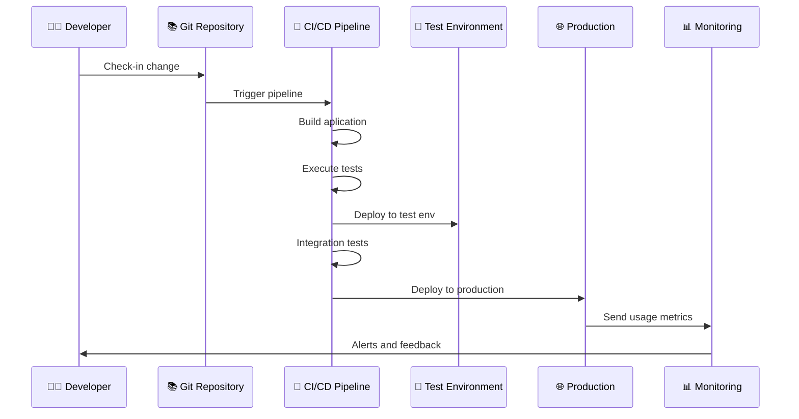

  ## Microcredencial Git
  # CI/CD con Github Actions

---

# Índice 

 

1. Introducción teórica
2. GitHub Actions

---

# Dev vs Ops

  

    <h3 class="text-blue-600">👨‍💻 Desarrollo (Dev)</h3>
    <ul>
      <li><b>Objetivo:</b> Crear nuevas funcionalidades</li>
      <li><b>Mentalidad:</b> "Cambio y velocidad"</li>
      <li><b>Métricas:</b> Velocidad de desarrollo, nuevas features</li>
      <li><b>Responsabilidad:</b> Hasta el deployment</li>
    </ul>
    

      
"Funciona en mi máquina" 🤷‍♂️

    

  

  
  

    <h3 class="text-red-600">🔧 Operaciones (Ops)</h3>
    <ul>
      <li><b>Objetivo:</b> Mantener sistemas estables y seguros</li>
      <li><b>Mentalidad:</b> "Estabilidad y control"</li>
      <li><b>Métricas:</b> Uptime, rendimiento, seguridad</li>
      <li><b>Responsabilidad:</b> Producción y mantenimiento</li>
    </ul>
    

      
"No toques nada que funcione" 🚫

    

  

  
⚔️

  
Conflicto natural entre velocidad y estabilidad

<!-- operaciones quiere que el servidor funcione y no lo toques -->

---

# DevOps

<Definicion title="DevOps" emoji="🔄">
  DevOps es un conjunto de prácticas, técnicas y herramientas que unifica los equipos de desarrollo de software (Dev) y operaciones (Ops).
</Definicion>

  

    <ul>
      <li>
        <b>Objetivo principal:</b>
        <ul>
          <li>Reducir tiempos de entrega de software de calidad</li>
        </ul>
      </li>
      <li>
        <b>Rompe las barreras entre:</b>
        <ul>
          <li>Desarrollo (Dev) 👨‍💻</li>
          <li>Operaciones (Ops) 🔧</li>
        </ul>
      </li>
    </ul>
  

  

    

      
🤝

      
Dev + Ops = DevOps

      
"You build it, you run it"

    

  

<!-- integración continua a lo salvaje -->

---

# DevOps en la Práctica: Ejemplo

  

  

  

  <b>Integración Continua</b> (CI)   +   <b>Despliegue Continuo</b> (CD)

  

    
🤖

    
Automatización total

    
Del commit a producción

    
✨ 🚀 ⚡

  

<!-- A/B testing -->

---

# Herramientas del Ecosistema DevOps

 

  

    <h4 class="text-blue-600 font-bold">🔧 Desarrollo</h4>
    <ul class="text-sm">
      <li>Git, GitHub, GitLab</li>
      <li>IDE/Editors</li>
      <li>Jira, Trello</li>
    </ul>
  

  
  

    <h4 class="text-green-600 font-bold">🏗️ Build & CI/CD</h4>
    <ul class="text-sm">
      <li>Jenkins, GitHub Actions</li>
      <li>GitLab CI, Azure DevOps</li>
      <li>Travis CI, CircleCI</li>
    </ul>
  

  
  

    <h4 class="text-purple-600 font-bold">🧪 Testing</h4>
    <ul class="text-sm">
      <li>JUnit, Jest, Selenium</li>
      <li>SonarQube</li>
      <li>Postman, Newman</li>
    </ul>
  

  
  

    <h4 class="text-orange-600 font-bold">📦 Containerización</h4>
    <ul class="text-sm">
      <li>Docker</li>
      <li>Kubernetes</li>
      <li>Helm</li>
    </ul>
  

  
  

    <h4 class="text-red-600 font-bold">☁️ Cloud & Infraestructura</h4>
    <ul class="text-sm">
      <li>AWS, Azure, GCP</li>
      <li>Terraform, Ansible</li>
      <li>Vagrant</li>
    </ul>
  

  
  

    <h4 class="text-indigo-600 font-bold">📊 Monitorización</h4>
    <ul class="text-sm">
      <li>Prometheus, Grafana</li>
      <li>ELK Stack</li>
      <li>New Relic, Datadog</li>
    </ul>
  

  
🎯 El objetivo no es usar todas las herramientas, sino elegir las que mejor se adapten a tu contexto

---

# Integración / Despliegue Continuo

  <Definicion title="Integración Continua (CI)" emoji="🔄">
    Práctica de integrar cambios de código de forma frecuente en un repositorio compartido,
    ejecutando automáticamente build y pruebas para detectar errores lo antes posible.
  </Definicion>

  <Definicion title="Despliegue Continuo (CD)" emoji="🚀">
    Práctica de publicar automáticamente en producción cada cambio que supera las validaciones
    del pipeline, sin intervención manual en la fase de despliegue.
  </Definicion>

--- 

# Github Actions

GitHub Actions es la plataforma de automatización de GitHub para definir workflows (CI/CD) en YAML que se ejecutan en respuesta a eventos del repositorio.

  

    <h4 class="text-blue-600 font-bold">⚙️ Workflows</h4>
    
Un proceso que ejecuta jobs cuando ocurre un evento.

  

  

    <h4 class="text-green-600 font-bold">📣 Events</h4>
    
Actividad que lanza un workflow (push, pull_request, schedule, etc.).

  

  

    <h4 class="text-purple-600 font-bold">🧩 Jobs</h4>
    
Conjunto de steps que se ejecutan en un runner (en paralelo o en secuencia).

  

  

    <h4 class="text-teal-600 font-bold">🪜 Steps</h4>
    
Pasos individuales dentro de un job. Pueden ser un shell script o un Action.

  

  

    <h4 class="text-orange-600 font-bold">🔨 Actions</h4>
    
Acciones reutilizables que encapsulan tareas (publicadas en Marketplace o locales).

  

  

    <h4 class="text-red-600 font-bold">🏃‍♂️ Runners</h4>
    
Máquinas (hosted o self-hosted) donde se ejecutan los jobs y sus steps.

  

<InfoBox content="Cada workflow se define con un archivo <code>*.yml</code> en el directorio <code>.github/workflows/</code> del repositorio, que especifica eventos, jobs, steps, etc."/>

---

# Github Actions

