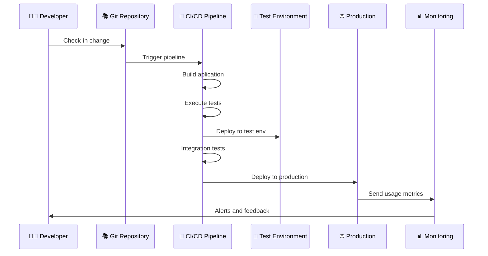

  ## Microcredencial Git
  # CI/CD con Github Actions

---

# Índice 

<br>

1. Introducción teórica
2. GitHub Actions

---

# Dev vs Ops

<div grid="~ cols-2 gap-2" m="t-10">
  <div>
    <h3 class="text-blue-600">👨‍💻 Desarrollo (Dev)</h3>
    <ul>
      <li><b>Objetivo:</b> Crear nuevas funcionalidades</li>
      <li><b>Mentalidad:</b> "Cambio y velocidad"</li>
      <li><b>Métricas:</b> Velocidad de desarrollo, nuevas features</li>
      <li><b>Responsabilidad:</b> Hasta el deployment</li>
    </ul>
    <div class="mt-4 p-3 bg-blue-100 rounded">
      <p class="text-sm">"Funciona en mi máquina" 🤷‍♂️</p>
    </div>
  </div>
  
  <div>
    <h3 class="text-red-600">🔧 Operaciones (Ops)</h3>
    <ul>
      <li><b>Objetivo:</b> Mantener sistemas estables y seguros</li>
      <li><b>Mentalidad:</b> "Estabilidad y control"</li>
      <li><b>Métricas:</b> Uptime, rendimiento, seguridad</li>
      <li><b>Responsabilidad:</b> Producción y mantenimiento</li>
    </ul>
    <div class="mt-4 p-3 bg-red-100 rounded">
      <p class="text-sm">"No toques nada que funcione" 🚫</p>
    </div>
  </div>
</div>

<div class="mt-6 text-center">
  <div class="text-4xl mb-2">⚔️</div>
  <p class="text-lg font-semibold text-gray-600">Conflicto natural entre velocidad y estabilidad</p>
</div>

<!-- operaciones quiere que el servidor funcione y no lo toques -->

---

# DevOps

<Definicion title="DevOps" emoji="🔄">
  DevOps es un conjunto de prácticas, técnicas y herramientas que unifica los equipos de desarrollo de software (Dev) y operaciones (Ops).
</Definicion>

<div grid="~ cols-2 gap-2" m="t-5">
  <div>
    <ul>
      <li>
        <b>Objetivo principal:</b>
        <ul>
          <li>Reducir tiempos de entrega de software de calidad</li>
        </ul>
      </li>
      <li>
        <b>Rompe las barreras entre:</b>
        <ul>
          <li>Desarrollo (Dev) 👨‍💻</li>
          <li>Operaciones (Ops) 🔧</li>
        </ul>
      </li>
    </ul>
  </div>
  <div class="flex justify-center items-center">
    <div class="text-center">
      <div class="text-8xl mb-4">🤝</div>
      <p class="text-lg font-semibold">Dev + Ops = DevOps</p>
      <div class="mt-4 text-sm text-gray-600 italic">"You build it, you run it"</div>
    </div>
  </div>
</div>

<!-- integración continua a lo salvaje -->

---

# DevOps en la Práctica: Ejemplo

<div grid="~ cols-2 gap-6" m="t-5">
  <div>
  

  </div>
</div>

<div class="absolute top-1/2 right-15 -translate-y-1/2 bg-yellow-100 border-l-4 border-yellow-500 text-yellow-700 p-2 rounded shadow-lg max-w-60 text-md z-10 text-center">
  <b>Integración Continua</b> (CI) <br> + <br> <b>Despliegue Continuo</b> (CD)
</div>

<div class="absolute bottom-5 right-5 flex justify-center items-center z-10">
  <div class="bg-gradient-to-r from-green-100 to-blue-100 border-l-4 border-green-500 text-green-700 p-3 rounded shadow-lg max-w-xs text-sm text-center">
    <div class="text-xl mb-1">🤖</div>
    <div class="font-bold mb-1">Automatización total</div>
    <div class="text-xs text-gray-700 font-semibold mb-1">Del commit a producción</div>
    <div class="mt-1 text-base">✨ 🚀 ⚡</div>
  </div>
</div>

<!-- A/B testing -->

---

# Herramientas del Ecosistema DevOps

<br>

<div grid="~ cols-3 gap-4" m="t-5">
  <div>
    <h4 class="text-blue-600 font-bold">🔧 Desarrollo</h4>
    <ul class="text-sm">
      <li>Git, GitHub, GitLab</li>
      <li>IDE/Editors</li>
      <li>Jira, Trello</li>
    </ul>
  </div>
  
  <div>
    <h4 class="text-green-600 font-bold">🏗️ Build & CI/CD</h4>
    <ul class="text-sm">
      <li>Jenkins, GitHub Actions</li>
      <li>GitLab CI, Azure DevOps</li>
      <li>Travis CI, CircleCI</li>
    </ul>
  </div>
  
  <div>
    <h4 class="text-purple-600 font-bold">🧪 Testing</h4>
    <ul class="text-sm">
      <li>JUnit, Jest, Selenium</li>
      <li>SonarQube</li>
      <li>Postman, Newman</li>
    </ul>
  </div>
  
  <div>
    <h4 class="text-orange-600 font-bold">📦 Containerización</h4>
    <ul class="text-sm">
      <li>Docker</li>
      <li>Kubernetes</li>
      <li>Helm</li>
    </ul>
  </div>
  
  <div>
    <h4 class="text-red-600 font-bold">☁️ Cloud & Infraestructura</h4>
    <ul class="text-sm">
      <li>AWS, Azure, GCP</li>
      <li>Terraform, Ansible</li>
      <li>Vagrant</li>
    </ul>
  </div>
  
  <div>
    <h4 class="text-indigo-600 font-bold">📊 Monitorización</h4>
    <ul class="text-sm">
      <li>Prometheus, Grafana</li>
      <li>ELK Stack</li>
      <li>New Relic, Datadog</li>
    </ul>
  </div>
</div>

<div class="mt-6 text-center">
  <p class="text-sm text-gray-600">🎯 El objetivo no es usar todas las herramientas, sino elegir las que mejor se adapten a tu contexto</p>
</div>

---

# Integración / Despliegue Continuo

<div grid="~ cols-2 gap-6" m="t-6">
  <Definicion title="Integración Continua (CI)" emoji="🔄">
    Práctica de integrar cambios de código de forma frecuente en un repositorio compartido,
    ejecutando automáticamente la construcción y pruebas para detectar errores lo antes posible.
  </Definicion>

  <Definicion title="Despliegue Continuo (CD)" emoji="🚀">
    Práctica de publicar automáticamente en producción cada cambio que supera las validaciones
    establecidas, sin intervención manual en la fase de despliegue.
  </Definicion>
</div>

--- 

# Github Actions

GitHub Actions es la plataforma de automatización de GitHub para definir workflows (CI/CD) en YAML que se ejecutan en respuesta a eventos del repositorio.

<div grid="~ cols-3 gap-4" m="t-5">
  <div>
    <h4 class="text-blue-600 font-bold">⚙️ Workflows</h4>
    <p class="text-sm">Un proceso que ejecuta jobs cuando ocurre un evento. Fichero YAML. <a href="https://github.com/actions/starter-workflows">Repositorio de templates.</a></p>
  </div>

  <div>
    <h4 class="text-red-600 font-bold">🏃‍♂️ Runners</h4>
    <p class="text-sm">Máquinas (en la nube o self-hosted) donde se ejecutan los jobs y sus steps. <a href="https://github.com/actions/runner-images">Máquinas disponibles</a>.</p>
  </div>

  <div>
    <h4 class="text-green-600 font-bold">📣 Events</h4>
    <p class="text-sm">Los workflows se activan por eventos (push, pull_request, schedule, etc.). <a href="https://docs.github.com/en/actions/reference/workflows-and-actions/events-that-trigger-workflows">Lista de eventos disponibles.</a></p>
  </div>

  <div>
    <h4 class="text-purple-600 font-bold">🧩 Jobs</h4>
    <p class="text-sm">Conjunto de comandos que se ejecutan. Cada job se ejecuta en una instancia runner nueva. Pueden lanzarse en paralelo (por defecto) o secuencialmente.</p>
  </div>

  <div>
    <h4 class="text-teal-600 font-bold">🪜 Steps</h4>
    <p class="text-sm">Pasos individuales dentro de un job. Pueden ser un shell script o un Action. Se ejecutan de manera secuencial.</p>
  </div>

  <div>
    <h4 class="text-orange-600 font-bold">🔨 Actions</h4>
    <p class="text-sm">Bloques reutilizables que se pueden ejecutar en un step (<a href="https://github.com/marketplace?type=actions">Marketplace</a>).</p>
  </div>
</div>

<div class="text-sm p-3 border-l-4 border-purple-500 bg-purple-500/10">
Cada workflow se define con un archivo <code>*.yml</code> en el directorio <code>.github/workflows/</code>. Especifica eventos, jobs, steps, etc.
<br>
<!-- <a href="https://docs.github.com/en/billing/concepts/product-billing/github-actions#free-use-of-github-actions">Limitaciones de uso</a> de GitHub Actions según suscripción. -->
</div>


---
layout: two-cols
---
# Workflow básico

::left::

```yml{*|1|3-5|7-9|7-11|11-13|11-20|11-23}
name: Java Maven Build

on:
  push:
    branches: [ "main" ]

jobs:
  build:
    runs-on: ubuntu-latest

    steps:
      - name: Clonar repositorio
        uses: actions/checkout@v4

      - name: Configurar JDK 21
        uses: actions/setup-java@v4
        with:
          java-version: '21'
          distribution: 'temurin'
          cache: 'maven'

      - name: Compilar y empaquetar
        run: mvn clean package
```

::right::

<br>
<br>

<div class="pl-6 flex flex-col gap-2">

<v-click at="1">
<div class="text-sm p-3 border-l-4 border-blue-500 bg-blue-500/10">
Nombre del workflow, se verá en la pestaña Actions en GitHub.
</div>
</v-click>

<v-click at="2">
<div class="text-sm p-3 border-l-4 border-green-500 bg-green-500/10">
Evento: El workflow se dispara solo al hacer push en la rama main.
</div>
</v-click>

<v-click at="3">
<div class="text-sm p-3 border-l-4 border-purple-500 bg-purple-500/10">
Runner: Se define el job <code>build</code>, que se ejecutará en una máquina virtual Linux.
</div>
</v-click>

<v-click at="5">
<div class="text-sm p-3 border-l-4 border-orange-500 bg-orange-500/10">
Acción <code>Checkout</code>: ejecuta <code>git clone</code>.
</div>
</v-click>

<v-click at="6">
<div class="text-sm p-3 border-l-4 border-cyan-500 bg-cyan-500/10">
Instalación del JDK 21 con distribución Temurin y caché de dependencias.
</div>
</v-click>

<v-click at="7">
<div class="text-sm p-3 border-l-4 border-red-500 bg-red-500/10">
Ejecución directa de Maven para compilar y empaquetar el proyecto.
</div>
</v-click>

</div>

---
layout: two-cols
---

# Step

::left::

```yml
- name: Empaquetar proyecto con Maven
  id: maven_package  # id opcional
  if: success() # por defecto siempre es success
  run: mvn clean package -DskipTests
  working-directory: <path>  # opcional
  shell: bash
  env:  # variables de entorno para este Step
    MAVEN_OPTS: "-Xmx1024m"  
  continue-on-error: true
  timeout-minutes: 15
```

::right::

<br>
<br>

<div class="pl-6 flex flex-col gap-2">

<div class="text-sm p-3 border-l-4 border-red-500 bg-red-500/10">
Cada <code>Step</code> se ejecuta con un proceso shell nuevo, desde el directorio raiz. Usar comando <code>cd</code> en cada Step, o establecer <code>working-directory</code>.
</div>

<div class="text-sm p-3 border-l-4 border-blue-500 bg-blue-500/10">
Pueden ejecutarse condicionalmente con <code>if</code>:
<ul>
<li> <code>success()</code>: se ejecuta si el Step anterior fue exitoso </li>
<li> <code>failure()</code>: se ejecuta si algún Step anterior falló </li>
<li> <code>always()</code>: se ejecuta siempre </li>
<li> <code>cancelled()</code>: se ejecuta si el workflow se canceló </li>
<li> <code>steps.maven_package.outcome == 'failure'</code> </li>:  comprobando el estado de un step concreto 
</ul>
</div>

<div class="text-sm p-3 border-l-4 border-green-500 bg-green-500/10">
Definición de variables de entorno <code>env</code>:
<ul>
<li> A nivel del Step </li>
<li> A nivel del job </li>
<li> A nivel del Workflow </li>
</ul>
</div>

</div>

---

# Ejercicio 1.1

Creación de un `Workflow` sencillo

1. Descargar el código fuente de una aplicación java sencilla en este <a href="https://unican-my.sharepoint.com/:u:/g/personal/rivasjm_unican_es/IQAUk8dBve_4TYZ38QRCCxpPAfCJZ-LyN4gNZUx-iToxzrg?e=WbwQHb"> enlace</a>
2. Crear un repositorio en GitHub para alojar el código de esa aplicación.
3. Activar GitHub Actions en el repositorio: `Settings -> Actions -> General -> Allow all actions`
4. Crear un `Workflow` de GitHub Actions para compilar, ejecutar las pruebas y empaquetar el programa en un archivo `jar`.
    - El Workflow tiene que ejecutarse al hacer un push en la rama `main`
    - La aplicación utiliza el gestor Maven.
        - Compilación: `mvn clean compile`
        - Ejecución de las pruebas: `mvn clean test`
        - Empaquetamiento: `mvn clean package`
5. Comprobar que el `Workflow` se ejecuta cuando se hace un push en la rama `main`

---

# Ejercicio 1.2

Comprobar cómo se visualiza un `Workflow` que falla.

1. Crear una rama nueva, y comprobar que cuando se hace un `push` de esa rama, el `Workflow` no se ejecuta.
2. Modificar el `Workflow` para que también se ejecute en la rama nueva. Comprobar que el `Workflow` se ejecuta ahora.
3. Modificar algun fichero java para añadir algún tipo de error de compilación. Comprobar que el `Workflow` falla.
4. Rehacer el cambio anterior. Comprobar que ahora el `Workflow` funciona.
5. Modificar cualquier prueba para que no pasen correctamente. 
    - Las pruebas se encuentran en el directorio `src/test/java`. 
    - Buscar alguna aserción como `assertEquals(550, firstMovie.getId());`, y cambiar el valor esperado (550 por otro)
    - Comprobar que ahora el `Workflow` falla.

---

# Ejercicio 1.3

Recuperar artefactos que se generan en GitHub Actions.

1. La ejecución de Maven genera una serie de artefactos que muestran información detallada del proceso de compilación, pruebas o empaquetado. Estos artefactos se generan en el directorio `target`
    - Comprobar que el directorio `target` esta siendo ignorado por git (fichero `.gitignore`)
2. Recuperar estos artefactos utilizando la acción `actions/upload-artifact@v4`. Tiene dos parámetros:
    - path: directorio que queremos recuperar 
    - name: nombre que le vamos a dar a este artefacto (puede ser cualquiera)
3. Hacer que el `Step` que sube los artefactos sólo ocurra cuando las pruebas fallen 
    - Para hacer esto, lo recomendable es tener un `Step` que únicamente ejecute las pruebas.
    - Subir sólo los artefactos localizados en el directorio `target/surefire-reports/`

---
layout: two-cols-header
---

# Dependencias entre Workflows

Podemos lanzar un `Workflow` cuando termina otro utilizando `workflow_run`

<br>

::left::

```yml
# Este Workflow depende del Workflow  "CI Build"   
on:
  workflow_run:
    workflows: ["CI Build"]
    types: [completed]

jobs:
  run-after-build:
    if: github.event.workflow_run.conclusion == 'success'
    runs-on: ubuntu-latest
    steps:
      - name: Notificar o continuar pipeline
        run: echo "El workflow 'CI Build' finalizó correctamente."
```

::right::

- Este `Workflow` se lanzará cuando el `Workflow` `"CI Build"` termine, aunque este falle.
- Podemos poner una condicón `if` al `job` para que se ejecute sólo cuando el `Workflow` haya finalizado exitosamente.

---
layout: two-cols-header
---

# Dependencias entre Jobs

Por defecto los `jobs` dentro de un `workflow` se ejecutan en paralelo. Con `needs` podemos establecer dependencias entre `jobs`.

<br>

::left::

```yml
jobs:
  compile:
    runs-on: ubuntu-latest
    steps:
      - name: Compilar
        run: |
          mvn clean compile

  test:
    needs: compile
    runs-on: ubuntu-latest
    steps:
      - name: Ejecutar pruebas si la compilación funcionó
        run: |
          mvn clean test
```

::right::

- El `job` `test` se ejecuta cuando `compile` termina exitosamente.
- Podemos hacer que un `job` se ejecute cuando otro falle, añadiendo una clausula `if` al `job`
    - `- if failure()`

---
layout: two-cols-header
---

# Matrices (`strategy.matrix`)

`strategy.matrix` permite ejecutar el mismo job varias veces, con distintas configuraciones. Típicamente para probar distintos sistemas operativos o versiones de librerías.
::left::

```yml
jobs:
  build-and-test:
    runs-on: ${{ matrix.os }}
    strategy:
      fail-fast: false
      matrix:
        os: [ubuntu-latest, windows-latest, macos-latest]
        java: [11, 17]
    steps:
      - name: Checkout
        uses: actions/checkout@v4

      - name: Setup Java
        uses: actions/setup-java@v4
        with:
          distribution: temurin
          java-version: ${{ matrix.java }}

      - name: Build and test
        run: ...
```

::right::

- Este ejemplo ejecuta el `job` `build-and-test` 6 veces.
    - 2 versiones de Java (11, 17)
    - 3 sistemas operativos distintos (Linux, Windows, macOS)
- Por defecto, si un `job` falla, se cancela toda la matriz. 
    - Para no cancelar la matriz, usar `fail-fast: false`.

---

# Ejercicio 1.4 — Dependencias entre jobs

Crear un workflow que contenga dos jobs: `compile` y `test`.

Instrucciones:
1. En el Ejercicio 1.3, todo se ejecutaba en el mismo `job`. Ahora tenemos que modificar ese `workflow` para que haga el trabajo en varios `jobs`.
    - El `job` `compile` debe compilar el proyecto:
    - El `job` `test` debe ejecutar las pruebas. Sólo debe ejecutarse si el `job` `compile` fue exitoso. La recuperación de artefactos puede hacerse en este `job`.
2. Verificar en la pestaña Actions que `test` se ejecuta solo si `compile` finaliza correctamente.

<br>
<br>

<div class="text-sm p-3 border-l-4 border-purple-500 bg-purple-500/10">
<b>NOTA</b> Cada job se ejecuta en una máquina virtual nueva. Este ejercicio sirve para establecer dependencias entre tareas. Pero en un caso real, separar compilación y test de esta manera no tendría sentido, porque el job de las pruebas hace la compilación.
</div>

---

# Ejercicio 1.5 — Matrix

Crear un workflow para compilar y ejecutar pruebas en macOS, Windows y Linux usando `strategy.matrix`.

Instrucciones:
1. Modificar el `workflow` del ejercicio 1.4 para:
    - Compilar con java versión 17 y linux.
    - Ejecutar las pruebas en macOS, windows y linux, utilizando JDK versión 17, 21 y 25.
2. Comprobar cómo se muestran los `jobs` en la pestaña `Actions` del repositorio.

---

# GitHub Releases

Publicar una versión distribuible de la aplicación dentro de GitHub

<div class="flex justify-center mt-4">
  
</div>

---

# GitHub Releases

Se recomienda utilizar la acción predefinida `softprops/action-gh-release`.
<br>
<a href="https://github.com/softprops/action-gh-release"> Documentación </a>

<br>
Configuración básica:
```yml
- name: Create Release
  uses: softprops/action-gh-release@v1
  if: github.ref_type == 'tag'  # sólo ejecutarlo si se ha lanzado por la creación de un tag
  with:
    files: | # aquí van los archivos que queremos publicar en la release. Lo normal es que se creen en jobs anteriores.
      */*.zip 
    body: |
      # Descripción del release. Típicamente en formato Markdown.
      # Se pueden poner múltiples líneas.
    body_path: <path> # alternativamente la descripción puede venir de un archivo
    prerelease: false
```

---

# Ejercicio 1.6 - Creación de un Release

Crear un Github Release cada vez que se crea una etiqueta con formato `v*`

1. Crear un nuevo `workflow` (un nuevo fichero .yml) para hacer el *release*.
2. Para facilitar el proceso, se puede utilizar este <a href="https://raw.githubusercontent.com/rivasjm/ucred-java-ui-movies/refs/heads/main/.github/workflows/release.yml">workflow</a>
    - El job `build-jar` construye el archivo jar (empaquetamiento de aplicaciones Java)
    - El job `build-portable` utiliza la herramienta `jpackage` para crear ejecutables de la aplicación. Utiliza `strategy.matrix` para crear ejecutables para Windows, macOS y Linux.
    - El job `create-release` utiliza el Action `softprops/action-gh-release@v1` para crear el GitHub Release.
3. Comprobar que al crear una etiqueta nueva con nombre `v*` (por ejemplo v1.0.0), se crea la Release.
4. Modificar el workflow para que el body del Release se extraiga de un fichero.
    - Hay que crear este fichero antes, y subirlo al repositorio.

---
layout: two-cols-header
---

# GitHub Secrets

**Problema**: ¿Y si necesitamos alguna contraseña o API Key secreta para ejecutar las pruebas o hacer el despliegue?

::left::

<div class="flex justify-center mt-4">
  
</div>

::right::

<div class="pl-6">

Esos Secrets son accesibles en el `workflow`:
- `${{ secrets.WEBDAV_PASSWORD }}`
- `${{ secrets.WEBDAV_URL }}`
- `${{ secrets.WEBDAV_USERNAME }}`

</div>

---

# Limitaciones de uso

<a href="https://docs.github.com/en/billing/concepts/product-billing/github-actions#free-use-of-github-actions"> Límites de uso según plan contratado </a>

<div class="flex justify-center mt-4">
  
</div>

---
layout: two-cols-header
---

# Ejecución Manual: `workflow_dispatch`

Permite lanzar workflows bajo demanda directamente desde la interfaz de GitHub sin necesidad de crear commits falsos.
<br>

::left::

```yml
name: Deploy Manual

on:
  push:
    branches: [ "main" ] 
  
  workflow_dispatch: # Activa el botón en la UI
    inputs:  # opcionalmente, permite definir parámetros
      entorno:
        description: 'Entorno de destino'
        required: true
        default: 'test'
        type: choice
        options:
          - test
          - prod
```

::right::

<div class="pl-6 flex flex-col gap-4">
  <div class="text-sm p-3 border-l-4 border-blue-500 bg-blue-500/10">
    <b>Botón "Run workflow":</b> Al añadir <code>workflow_dispatch</code> al bloque <code>on</code>, aparece un botón en la pestaña Actions para ejecutar el workflow sin necesidad de hacer un push.
  </div>
  <div class="text-sm p-3 border-l-4 border-green-500 bg-green-500/10">
    <b>Parámetros (Inputs):</b> Opcionalmente, puedes solicitar datos al usuario antes de la ejecución. Estos valores se utilizan en el workflow mediante la sintaxis <code v-pre>${{ inputs.entorno }}</code>.
  </div>
</div>