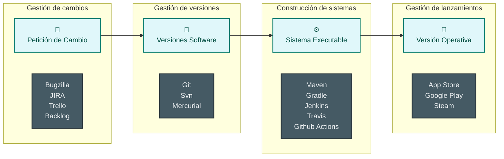
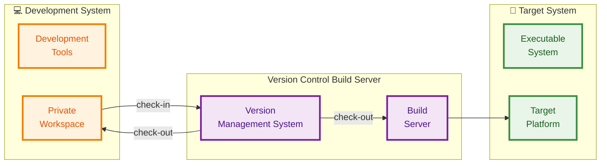
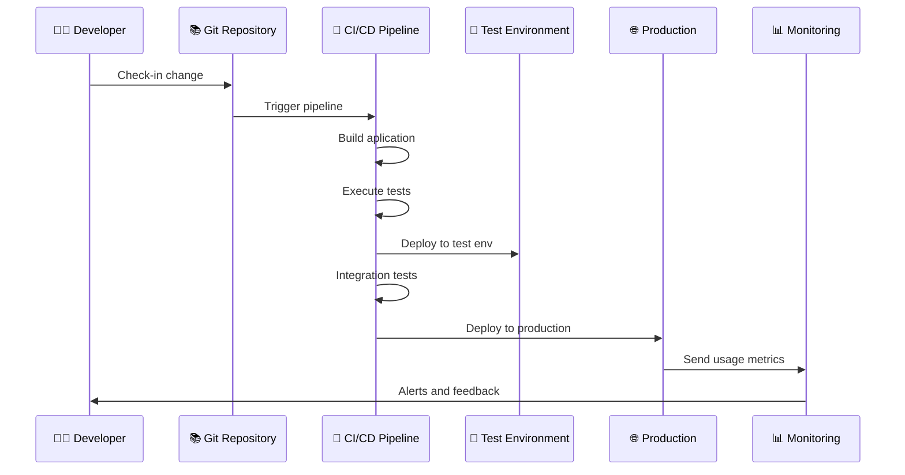

# Índice

 

1. Gestión de la configuración software  
2. Control de versiones con Git  
3. Modelos organizativos con Git  

---

# Gestión de la Configuración de Sistemas Software

<Definicion title="Gestión de la Configuración" emoji="🛠️">
  La gestión de la configuración se ocupa de las políticas, procesos y herramientas para gestionar los cambios en los <b>sistemas software</b>.
</Definicion>

  

    <ul>
      <li>
        <b>¿Por qué necesitas gestión de configuración?</b>
        <ul>
          <li>Es fácil perder el control de los cambios y versiones de componentes incorporados en cada versión del sistema.</li>
          <li>Es esencial en proyectos en equipo para controlar los cambios realizados por diferentes desarrolladores.</li>
        </ul>
      </li>
    </ul>
  

  

    👥
  

<!-- Software Configuration Management en ingles (SCM). ¿Qué cosas son cambiantes? -> ciclo de vida -->

---

# ¿Qué queremos evitar?

  

    <ul>
      <li>
        <b>Evitar el caos en el desarrollo</b>
        <ul>
          <li>Desorden en archivos y versiones.</li>
          <li>Dificultad para saber qué ha cambiado y quién lo ha hecho.</li>
          <li>Confusión y errores al integrar cambios.</li>
        </ul>
      </li>
    </ul>
  

  

    🧩
  

  

---

# ¿Por qué necesitamos Gestión de la Configuración? 

 

  

    ⏸️
    
¿Cómo hago como si no hubiese pasado nada?

    
Recuperar el estado anterior del sistema ante errores o cambios no deseados.

  

  

    👥
    
¿Cómo gestiono a dos personas trabajando en el mismo archivo?

    
Gestionar los cambios realizados por varios usuarios al mismo tiempo.

  

  

    🔍
    
¿Qué diferencias hay entre versiones?

    
Identificar y comparar los cambios entre distintas versiones de archivos.

  

  

    📋
    
Problema de la copia correcta

    
Facilitar la identificación de la versión correcta.

  

---

# Gestión de la Configuración dentro del Ciclo de Vida

  

---

# Gestión de la Configuración dentro del Ciclo de Vida

  

---

# Conceptos Clave

  <DefinicionCompacta title="Ítem de Configuración" emoji="📦">
    Elemento gestionado de manera individual en el sistema, como fichero de código fuente, documentación, ficheros de configuración, binarios, etc.
  </DefinicionCompacta>
  <DefinicionCompacta title="Versión" emoji="🔢">
    Instancia de un ítem de configuración que difiere de alguna manera de otras instancias del mismo ítem.
  </DefinicionCompacta>

  <DefinicionCompacta title="Baseline" emoji="📏">
    Conjunto de versiones de ítems de configuración que representa un estado significativo, claramente identificado, y aprobado, del sistema.
  </DefinicionCompacta>
  <DefinicionCompacta title="Mainline" emoji="🛤️">
    Secuencia de <em>Baselines</em> a lo largo del tiempo. Evolución de versiones significativas (rama<code>main</code>)
  </DefinicionCompacta>

  <DefinicionCompacta title="Release" emoji="🚀">
    Versión del sistema (un <em>Baseline</em>), o de un ítem de configuración concreto, que se distribuye a los usuarios finales o clientes.
  </DefinicionCompacta>

<!-- ejemplo de tabla con items y versiones -->

--- 

# Areas de la Gestión de la Configuración

 
 

---

# Sistema de desarrollo 

 

 

- **Check-out**: Se obtiene una versión del sistema (un *baseline*).
- **Check-in**: El desarrollador envía sus cambios desde su espacio de trabajo privado al sistema de control de versiones (nueva versión).

---

# Integración Continua

 

  

    <ul>
      <li>
        <b>¿Qué es la integración continua?</b>
        <ul>
          <li>Integrar frecuentemente los cambios de todos los desarrolladores en el servidor.</li>
          <li>Integración con pruebas automáticas.</li>
          <li>Permite detectar errores rápidamente y mantener el sistema siempre en un estado funcional.</li>
        </ul>
      </li>
      <li>
        <b>Herramientas habituales:</b>
        <ul>
          <li>Jenkins, GitHub Actions, GitLab CI, Travis CI</li>
        </ul>
      </li>
    </ul>
  

  

    

      
      
Figura obtenida de <b>Software Engineering</b>, 10th Edition, Ian Sommerville

    

  

---

# Dev vs Ops

  

    <h3 class="text-blue-600">👨‍💻 Desarrollo (Dev)</h3>
    <ul>
      <li><b>Objetivo:</b> Crear nuevas funcionalidades</li>
      <li><b>Mentalidad:</b> "Cambio y velocidad"</li>
      <li><b>Métricas:</b> Velocidad de desarrollo, nuevas features</li>
      <li><b>Responsabilidad:</b> Hasta el deployment</li>
    </ul>
    

      
"Funciona en mi máquina" 🤷‍♂️

    

  

  
  

    <h3 class="text-red-600">🔧 Operaciones (Ops)</h3>
    <ul>
      <li><b>Objetivo:</b> Mantener sistemas estables y seguros</li>
      <li><b>Mentalidad:</b> "Estabilidad y control"</li>
      <li><b>Métricas:</b> Uptime, rendimiento, seguridad</li>
      <li><b>Responsabilidad:</b> Producción y mantenimiento</li>
    </ul>
    

      
"No toques nada que funcione" 🚫

    

  

  
⚔️

  
Conflicto natural entre velocidad y estabilidad

<!-- operaciones quiere que el servidor funcione y no lo toques -->

---

# DevOps

<Definicion title="DevOps" emoji="🔄">
  DevOps es un conjunto de prácticas, técnicas y herramientas que unifica los equipos de desarrollo de software (Dev) y operaciones (Ops).
</Definicion>

  

    <ul>
      <li>
        <b>Objetivo principal:</b>
        <ul>
          <li>Reducir tiempos de entrega de software de calidad</li>
        </ul>
      </li>
      <li>
        <b>Rompe las barreras entre:</b>
        <ul>
          <li>Desarrollo (Dev) 👨‍💻</li>
          <li>Operaciones (Ops) 🔧</li>
        </ul>
      </li>
    </ul>
  

  

    

      
🤝

      
Dev + Ops = DevOps

      
"You build it, you run it"

    

  

<!-- integración continua a lo salvaje -->

---

# DevOps en la Práctica: Ejemplo

  

  

  

  <b>Integración Continua</b> (CI)   +   <b>Despliegue Continuo</b> (CD)

  

    
🤖

    
Automatización total

    
Del commit a producción

    
✨ 🚀 ⚡

  

<!-- A/B testing -->

---

# Herramientas del Ecosistema DevOps

 

  

    <h4 class="text-blue-600 font-bold">🔧 Desarrollo</h4>
    <ul class="text-sm">
      <li>Git, GitHub, GitLab</li>
      <li>IDE/Editors</li>
      <li>Jira, Trello</li>
    </ul>
  

  
  

    <h4 class="text-green-600 font-bold">🏗️ Build & CI/CD</h4>
    <ul class="text-sm">
      <li>Jenkins, GitHub Actions</li>
      <li>GitLab CI, Azure DevOps</li>
      <li>Travis CI, CircleCI</li>
    </ul>
  

  
  

    <h4 class="text-purple-600 font-bold">🧪 Testing</h4>
    <ul class="text-sm">
      <li>JUnit, Jest, Selenium</li>
      <li>SonarQube</li>
      <li>Postman, Newman</li>
    </ul>
  

  
  

    <h4 class="text-orange-600 font-bold">📦 Containerización</h4>
    <ul class="text-sm">
      <li>Docker</li>
      <li>Kubernetes</li>
      <li>Helm</li>
    </ul>
  

  
  

    <h4 class="text-red-600 font-bold">☁️ Cloud & Infraestructura</h4>
    <ul class="text-sm">
      <li>AWS, Azure, GCP</li>
      <li>Terraform, Ansible</li>
      <li>Vagrant</li>
    </ul>
  

  
  

    <h4 class="text-indigo-600 font-bold">📊 Monitorización</h4>
    <ul class="text-sm">
      <li>Prometheus, Grafana</li>
      <li>ELK Stack</li>
      <li>New Relic, Datadog</li>
    </ul>
  

  
🎯 El objetivo no es usar todas las herramientas, sino elegir las que mejor se adapten a tu contexto

---