# Índice

<br>

1. Gestión de la configuración software  
2. <span style="color: red; font-weight: bold;">Control de versiones con Git</span>  
3. Modelos organizativos con Git  

---

# Índice

<br>

1. Gestión de la configuración software  
2. <span style="color: red; font-weight: bold;">Control de versiones con Git</span>  
    - <span style="color: red; font-weight: bold;">Repositorios locales</span>
    - Repositorios remotos
3. Modelos organizativos con Git  


---

# ¿Qué es Git? 

Git es un sistema de control de versiones distribuido, diseñado para gestionar el historial de cambios en proyectos de software. Permite a varios desarrolladores trabajar simultáneamente sobre el mismo código, facilitando la colaboración y el seguimiento de modificaciones.

<div grid="~ cols-2 gap-4" m="t-10">
  <div>
    <ul class="list-disc ml-5 text-sm">
      <li><span class="font-bold text-green-700">Control de versiones:</span> Guarda el historial de cambios y permite volver a versiones anteriores.</li>
      <li><span class="font-bold text-green-700">Distribuido y Descentralizado:</span> Cada usuario tiene una copia completa del repositorio.</li>
      <li><span class="font-bold text-green-700">Colaborativo:</span> Facilita el trabajo en equipo y la integración de cambios.</li>
      <li><span class="font-bold text-green-700">Seguro:</span> Detecta y previene pérdidas de información.</li>
      <li><span class="font-bold text-green-700">Uso local:</span> No requiere acceso a internet.</li>
      <li><span class="font-bold text-green-700">Intefaces gráficas:</span> Existe modo línea de comandos (núcleo de git), e interfaces gráficas para hacer más amigable su uso.</li>
    </ul>
  </div>
  <div class="flex justify-center items-center text-5xl">🧑‍💻👩‍💻</div>
</div>

---

# Historia y características principales de Git 

- Git fue creado en 2005 por Linus Torvalds, el autor de Linux, para gestionar el desarrollo del kernel.
- Nació como respuesta a la necesidad de un sistema rápido, seguro y distribuido tras la retirada de BitKeeper.
- Es el sistema de control de versiones más popular en el desarrollo de software moderno.

<div grid="~ cols-2 gap-4" m="t-10">
  <div>
    <ul class="list-disc ml-5 text-sm">
      <li><span class="font-bold text-green-700">Rápido:</span> Opera eficientemente incluso en proyectos grandes.</li>
      <li><span class="font-bold text-green-700">Integridad:</span> Cada cambio queda registrado y verificado.</li>
      <li><span class="font-bold text-green-700">Ramas y fusiones:</span> Permite crear ramas para nuevas funcionalidades y fusionarlas fácilmente.</li>
      <li><span class="font-bold text-green-700">Amplio soporte:</span> Utilizado por plataformas como GitHub, GitLab y Bitbucket.</li>
    </ul>
  </div>
  <div class="flex justify-center items-center text-5xl">🌱🔀</div>
</div>

---

# Configuración básica: `git config`

El comando `git config` se utiliza para configurar opciones y preferencias de Git a nivel de usuario, repositorio o sistema. Permite definir información como el nombre de usuario, correo electrónico, editor por defecto y otras opciones que afectan el comportamiento de Git.

**Parámetros básicos:**

```bash
# Configura el nombre de usuario globalmente
git config --global user.name "Tu Nombre"

# Configura el correo electrónico globalmente
git config --global user.email "tu@email.com"

# Ver todas las configuraciones
git config --list
```

<br>

Con `--global` se aplica la configuración a todos los repositorios del usuario. Con `--local` se aplican al repositorio actual.

<!-- Este fragmento de configuración se guarda en el archivo `.gitconfig` en el directorio $HOME -->

---

# Inicialización de un repositorio: `git init`

El comando `git init` se utiliza para crear un nuevo repositorio Git en el directorio actual. Este comando inicializa la estructura necesaria para el control de versiones.

**Uso básico:**

```bash
# Inicializa un repositorio Git en el directorio actual
git init

# Inicializa un repositorio en una carpeta específica
git init nombre-del-directorio
```

<br>

Después de ejecutar `git init`, se crea un subdirectorio oculto llamado `.git` que contiene toda la información del repositorio, historial y configuración.

<div class="bg-yellow-100 border-l-4 border-yellow-500 text-yellow-700 p-4 my-4 rounded">
  <span class="font-bold">Aviso:</span>
  El contenido del directorio <code>.git</code> <span class="font-semibold text-red-600">nunca debe editarse manualmente</span>. Modificar archivos dentro de <code>.git</code> puede corromper el repositorio y provocar pérdida de datos.
</div>

---

# Añadir y confirmar cambios: `git add`, `git commit`

Los cambios realizados en los ficheros se deben acumular en el **Staging Area** antes de ser confirmados:

- **Working Directory**: Es la carpeta local donde están y editas los archivos (el sistema de archivos local).
- **Staging Area (Index)**: Zona intermedia donde añades los cambios antes de confirmarlos.
- **Repository**: Donde se almacenan los archivos y sus versiones controlados por git.

<br> 

<div class="flex justify-center">
  <div class="w-full max-w-xl">
  
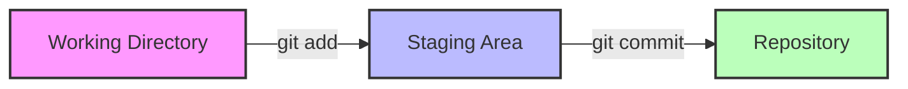

  </div>
</div>

**Comandos `add` y `commit`:**

- `git add <archivo>`: Añade los cambios del `<archivo>` del Working Directory al Staging Area.
- `git add .` Añade todos los cambios del Working Directory al Staging Area.
- `git commit -m "mensaje"`: Confirma los cambios del Staging Area. El `"mensaje"` debe describir el cambio. Los cambios pasan a ser parte del repositorio (__se crea una nueva versión del sistema__)

---

# Estados de un fichero en Git

Un fichero en un repositorio Git puede encontrarse en uno de los siguientes estados:

- ``UNTRACKED``: El fichero no está siendo gestionado por Git.
- ``TRACKED``: El fichero está bajo control de versiones y puede estar en uno de estos subestados:
  - ``UNMODIFIED``: No ha sufrido cambios desde el último commit.
  - ``MODIFIED``: Ha sido modificado desde el último commit.
  - ``STAGED``: Los cambios han sido añadidos al Staging Area y están listos para ser confirmados.

<br>

<div class="flex justify-center">
  <div class="w-full max-w-lg">
  
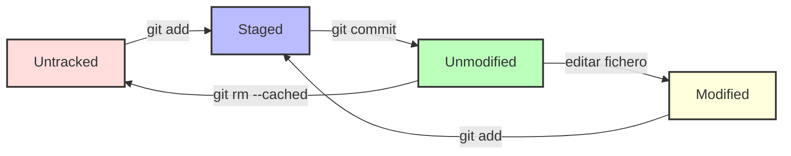

  </div>
</div>

<div class="mt-4 text-sm text-gray-500">
  Consejo: Usa <code>git status</code> para ver el estado actual de los ficheros (ver siguiente transparencia)
</div>
 
---

# Consultar el estado del repositorio: `git status`

El comando `git status` muestra información sobre el estado actual los archivos.

**Salida típica:**

```bash {*|1|3|4|6-8|10-13|15-17|*}
>> git status

On branch main
Your branch is up to date with 'origin/main'.

Changes to be committed:
  (use "git restore --staged <file>..." to unstage)
        modified:   README.md

Changes not staged for commit:
  (use "git add <file>..." to update what will be committed)
  (use "git restore <file>..." to discard changes in working directory)
        modified:   slides.md

Untracked files:
  (use "git add <file>..." to include in what will be committed)
        new_file.txt
```

---

# Ignorar archivos: `.gitignore`

En el fichero `.gitignore` se puede definir qué archivos deben ser ignorados por git. Los archivos ignorados nunca serán tenidos en cuenta por git.

```
# Ignorar archivos de configuración del sistema operativo
.DS_Store
Thumbs.db

# Ignorar archivos de logs
*.log

# Ignorar dependencias y entornos virtuales
node_modules/
venv/
.env

# Ignorar archivos de compilación
dist/
build/
*.pyc
```


---

# El grafo de commits en Git

Cada vez que se realiza un commit, Git crea un nuevo nodo en el grafo de commits. Cada nodo representa una versión distinta del sistema.

<div class="grid grid-cols-1 md:grid-cols-2 gap-8 items-start">
  <div>
    <div class="font-bold mb-2">Secuencia de comandos:</div>

```bash 
...
git commit -m "Commit inicial"

echo "# Proyecto" > README.md
git add README.md
git commit -m "Añade README"

echo "print('Hola')" > main.py
git add main.py
git commit -m "Implementa función principal"

echo "# Documentación" >> README.md
git add README.md
git commit -m "Actualiza documentación"
```

</div>
<div>
<div class="font-bold mb-2">Grafo de commits:</div>
  
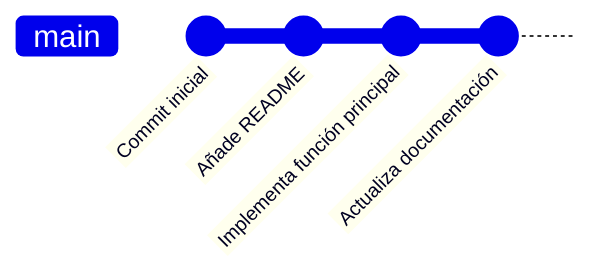
</div>
</div>
<br>


---

# Consultar el historial de commits: `git log`

<div class="grid grid-cols-1 md:grid-cols-2 gap-8 items-start">

<div class="w-100">
```bash
commit 4e3d2c1b
Author: Juan M Rivas <rivasjm@unican.es>
Date:   Wed Jun 5 10:30:00 2024 +0200

  Actualiza documentación

commit 3c2b1a0f
Author: Juan M Rivas <rivasjm@unican.es>
Date:   Wed Jun 5 10:25:00 2024 +0200

  Implementa función principal

commit 2b1a0f9e
Author: Juan M Rivas <rivasjm@unican.es>
Date:   Wed Jun 5 10:20:00 2024 +0200

  Añade README

commit 1a0f9e8d
Author: Juan M Rivas <rivasjm@unican.es>
Date:   Wed Jun 5 10:15:00 2024 +0200

  Commit inicial
```
</div>

<div>
<br>
<br>
<br>
<br>
<br>
<br>

</div>
</div>

---

# Secuencia lineal de commits
  
<br>
<div class="flex justify-center">
  <div class="w-full max-w-2xl">
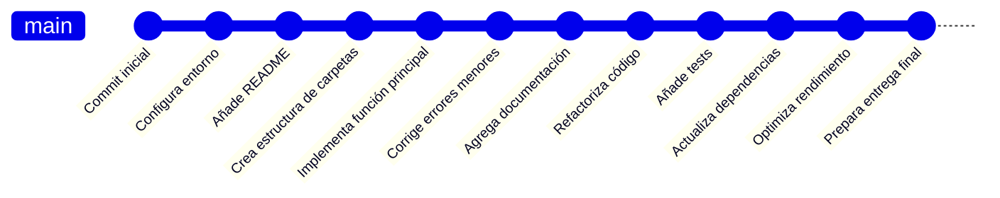
  </div>
</div>
<br>

- **Dificulta el trabajo en equipo:** Todos los cambios se realizan sobre la misma línea, lo que puede provocar conflictos frecuentes entre desarrolladores.
- **Falta de aislamiento:** No es posible separar nuevas funcionalidades, correcciones de errores o experimentos, lo que aumenta el riesgo de introducir errores en la versión principal.
- **Imposibilidad de desarrollo paralelo:** No se pueden trabajar varias tareas o features de forma simultánea sin interferir unas con otras.

<div class="absolute top-6 right-8 bg-red-100 border-l-4 border-red-500 text-red-700 p-4 rounded shadow-lg max-w-xs text-sm z-10">
  <span class="font-bold">Aviso:</span> Mala práctica.
</div>

---
layout: full
---

# Ramificación en Git

Cada rama es un nuevo camino independiente en el grafo de commits

<div class="flex justify-center">
  <div class="w-full max-w-xl my-8">
  
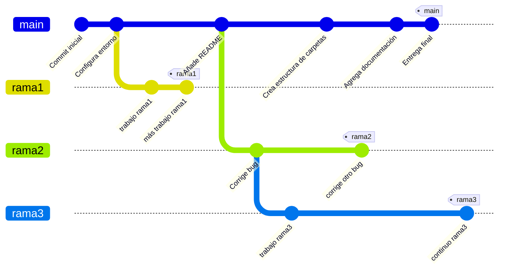
  </div>
</div>


---

# Crear ramas: `git branch` y `git checkout`

<div grid="~ cols-2 gap-10" m="t-10">

```bash
# Crear una nueva rama llamada 'rama1'
git branch rama1

# Cambiar a la nueva rama
git checkout rama1

# Realizar cambios y confirmarlos en la rama
echo "Nueva funcionalidad" > feature.txt
git add feature.txt
git commit -m "Añade nueva funcionalidad"
```

<div>
<br>
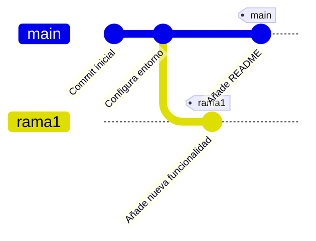
</div>
</div>


- `git branch <nombre>` Crea una nueva rama con nombre `<nombre>`
- `git checkout <nombre>` Para moverse entre ramas. Convierte la rama `<nombre>` en la rama activa. Los próximos commits se realizarán en esta rama. 

---

# Opciones del comando `git branch`

El comando `git branch` permite gestionar las ramas locales del repositorio.

**Opciones básicas:**

```bash
# Listar todas las ramas locales
git branch

# Listar todas las ramas remotas
git branch -r

# Listar todas las ramas (locales y remotas)
git branch -a

# Crear una nueva rama llamada 'nueva-rama'
git branch nueva-rama

# Renombrar una rama local
git branch -m nombre-antiguo nombre-nuevo

# Eliminar una rama local
git branch -d nombre-rama

```


---

# Referencia `HEAD`

**HEAD** es un puntero especial que indica el commit activo. La versión de los archivos en el Working Directory serán los asociados a dicho `commit`.

<div class="grid grid-cols-1 md:grid-cols-2 gap-12 items-start mt-10">
  
<div>
  <!-- <div class="font-bold mb-2">HEAD normalmente apunta a la rama activa:</div> -->
  <ul>
    <li><span class="font-semibold">HEAD</span> normalmente apunta al último commit de la rama activa.</li>
    <li>Al hacer <code>git checkout rama1</code>, <span class="font-semibold">HEAD</span> pasa a apuntar al último commit de <code>rama1</code>.</li>
    <li>Los nuevos commits se añaden a continuación del commit al que apunta <span class="font-semibold">HEAD</span>.</li>
  </ul>
  <br>
  <br>
</div>

<div>
  
<div>
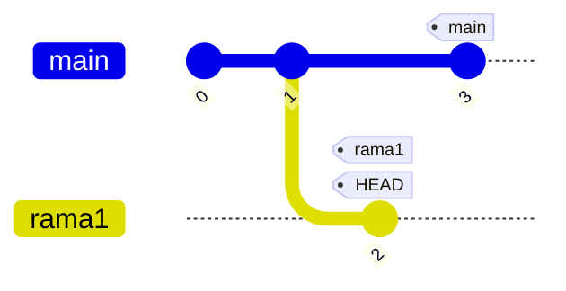
<div class="mt-4 text-sm text-gray-500">
  <span class="font-semibold">Nota:</span> En el diagrama, <span class="text-blue-600 font-semibold">HEAD</span> señala el último commit de <code>rama1</code>, indicando que es la rama activa.
</div>

</div>
</div>
</div>

<div class="absolute bottom-15 left-12 bg-orange-100 border-l-4 border-orange-500 text-orange-700 p-4 rounded shadow-lg max-w-2xl text-sm">
  Si <code>HEAD</code> no apunta al último <code>commit</code> de una rama, el repositorio entra en estado <code>DETACHED</code>.
</div>

---

# Fusionado de ramas: `git merge`

¿Cómo incorporar en la rama <span class="text-blue-600 font-bold">main</span> el trabajo realizado en la rama <span class="text-green-600 font-bold">rama1</span>?

<div class="flex justify-center">
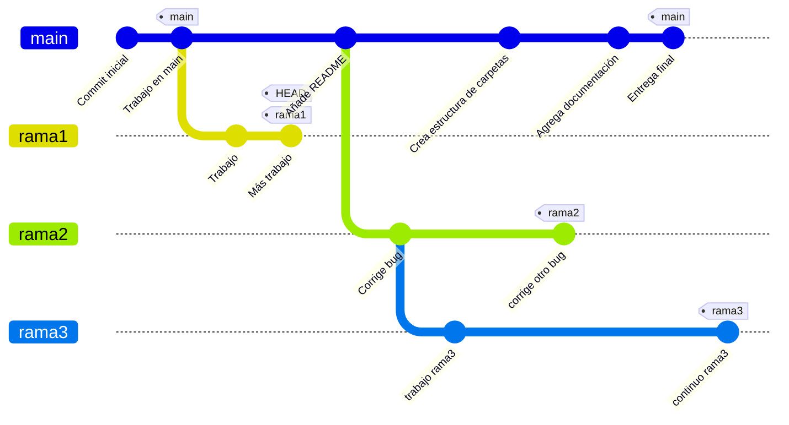
</div>

<hr class="border-gray-300 w-screen -ml-1/2 relative left-1/2" />

<div v-click grid="~ cols-2 gap-20">

<div>
<br>
```bash
git checkout main
git merge rama1
```
</div>

<div>
<br>
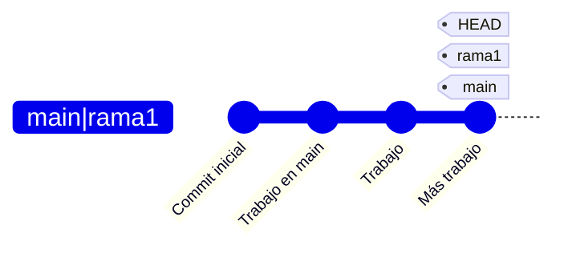
</div>

<div class="absolute bottom-10 left-15 bg-green-100 border-l-4 border-green-500 text-green-700 p-4 rounded shadow-lg max-w-xs text-sm">
  <span class="font-bold">Nota:</span> Esta fusión es de tipo <span class="font-semibold text-green-600">FAST-FORWARD</span>, ya que <code>main</code> no tiene nuevos commits desde que se creó la rama <code>rama1</code>
</div>

</div>


---

# Fusionado de ramas: `git merge`

¿Cómo incorporar en la rama <span class="text-blue-600 font-bold">main</span> el trabajo realizado en la rama <span class="text-green-600 font-bold">rama1</span>?

<div class="flex justify-center">

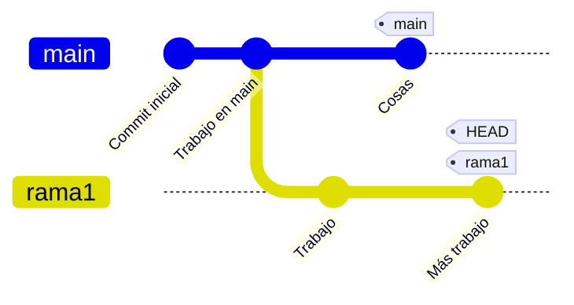
</div>

<hr class="border-gray-300 w-screen -ml-1/2 relative left-1/2" />

<div v-click grid="~ cols-2 gap-2">

<div>
<br>
```bash
git checkout main
git merge rama1
```
</div>

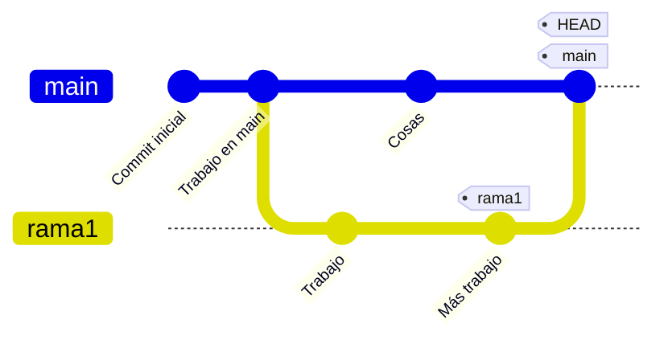
<div class="absolute bottom-10 left-15 bg-green-100 border-l-4 border-green-500 text-green-700 p-4 rounded shadow-lg max-w-sm text-sm">
  <span class="font-bold">Nota:</span> Esta fusión es de tipo <span class="font-semibold text-green-600">RECURSIVE</span>, ya que <code>main</code> tiene nuevos commits desde que se creó la rama <code>rama1</code>. Se genera un nuevo `commit` de fusión.
</div>

</div>

---

# Tipos de fusión recursiva en Git

Existen diferentes escenarios al fusionar ramas con el método recursivo:

<br>
<div grid="~ cols-2 gap-2" m="t-5">

<div>
  <div class="font-bold mb-2 text-green-700">1. Fusión simple</div>
  <ul class="list-disc ml-5 text-sm">
    <li>Los cambios de ambas ramas afectan archivos distintos.</li>
    <li>Git fusiona automáticamente los cambios.</li>
  </ul>
  <br>
  <div class="font-bold mb-2 text-green-700">2. Auto merge</div>
  <ul class="list-disc ml-5 text-sm">
    <li>Los cambios de ambas ramas afectan a los mismos ficheros, pero en distintas líneas.</li>
    <li>Git puede combinar los cambios automáticamente porque no hay conflictos.</li>
  </ul>
</div>

<div>
  <div class="font-bold mb-2 text-red-700">3. Fusión con conflictos</div>
  <ul class="list-disc ml-5 text-sm">
    <li>Ambas ramas modifican la misma línea de un archivo o archivos en conflicto.</li>
    <li>Git no puede fusionar automáticamente y marca los archivos en conflicto.</li>
    <li>El usuario debe resolver los conflictos manualmente y completar la fusión con <code>git add</code> y <code>git commit</code>.</li>
  </ul>
</div>
</div>

---

# Resolución de conflictos en Git

Cuando dos ramas modifican la misma línea de un archivo, Git no puede fusionarlas automáticamente y marca el archivo como en conflicto. Es necesario editar el archivo para resolver el conflicto manualmente.

<br>

<div grid="~ cols-2 gap-2" m="t-5">

<div>
  <div class="font-bold mb-2">Pasos para resolver un conflicto:</div>
  <ol class="list-decimal ml-5 text-sm">
    <li>Abre el archivo marcado con conflicto.</li>
    <li>Busca las marcas de conflicto <code>&lt;&lt;&lt;&lt;&lt;&lt;&lt;</code>, <code>=======</code> y <code>&gt;&gt;&gt;&gt;&gt;&gt;&gt;</code>.</li>
    <li>Edita el archivo para dejar solo la versión deseada.</li>
    <li>Guarda los cambios y añade los cambios con <code>git add &lt;archivo&gt;</code>.</li>
    <li>Completa la fusión con <code>git commit</code>.</li>
  </ol>
</div>

<div>
  <div class="font-bold mb-2">Ejemplo de fichero con conflicto:</div>

  ```bash
  print("Hola mundo")
  <<<<<<< HEAD
  print("Funcionalidad desde rama main")
  =======
  print("Funcionalidad desde rama rama1")
  >>>>>>> rama1
  print("Fin del programa")
  ```

  <div class="text-xs text-gray-500 mt-6">
    El bloque entre <code>&lt;&lt;&lt;&lt;&lt;&lt;&lt; HEAD</code> y <code>=======</code> corresponde a la rama actual.<br><br>
    El bloque entre <code>=======</code> y <code>&gt;&gt;&gt;&gt;&gt;&gt;&gt; rama1</code> corresponde a la rama fusionada.
  </div>
</div>
</div>

---

# Incorporar el trabajo de otros en tu rama

¿Cómo incorporar en tu rama de trabajo <span class="text-green-600 font-bold">rama1</span> el trabajo realizado en la rama <span class="text-blue-600 font-bold">main</span>?

<br>
<br>
<div class="flex justify-center">

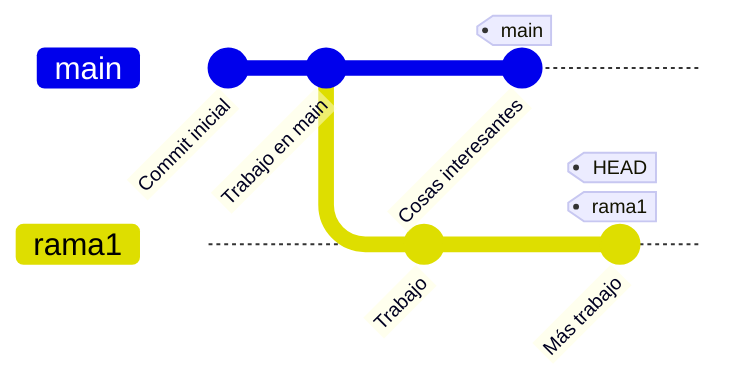
</div>


---

# Incorporar el trabajo de otros en tu rama

¿Cómo incorporar en tu rama de trabajo <span class="text-green-600 font-bold">rama1</span> el trabajo realizado en la rama <span class="text-blue-600 font-bold">main</span>?

<div class="flex justify-center">


</div>

<hr class="border-gray-300 w-screen -ml-1/2 relative left-1/2" />

<br>

<div grid="~ cols-2 gap-30">

<div>

<br>

<div v-mark.highlight.yellow class="text-xl font-extrabold mb-4">
  Con una fusión (<span class="uppercase">merge</span>)
</div>

```bash
git checkout rama1
git merge main
```
</div>

<div>
<br>

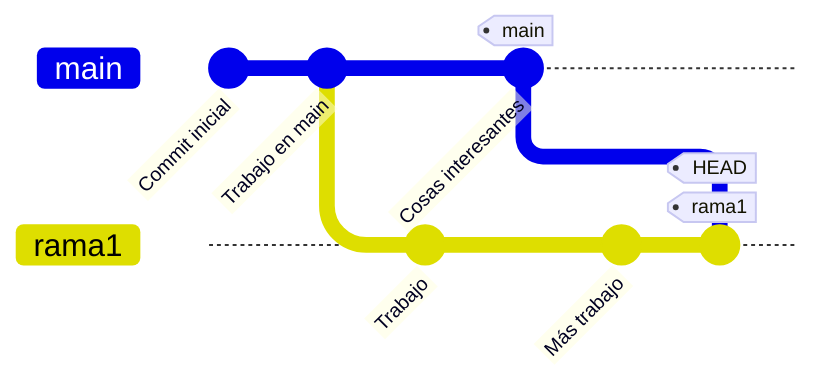
</div>
</div>

---

# Incorporar el trabajo de otros en tu rama

¿Cómo incorporar en tu rama de trabajo <span class="text-green-600 font-bold">rama1</span> el trabajo realizado en la rama <span class="text-blue-600 font-bold">main</span>?

<div class="flex justify-center">


</div>

<hr class="border-gray-300 w-screen -ml-1/2 relative left-1/2" />

<br>

<div grid="~ cols-2 gap-30">

<div>

<div v-mark.highlight.yellow class="text-xl font-extrabold mb-4">
  Con (<span class="uppercase">rebase</span>)
</div>

```bash
git checkout rama1
git rebase main
```
</div>

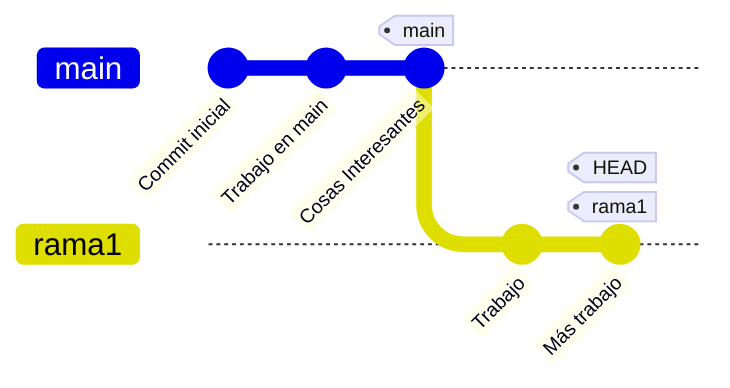
</div>

<div class="absolute bottom-10 left-13 bg-red-100 border-l-4 border-red-500 text-red-700 p-2 rounded shadow-lg max-w-md text-sm z-10">
  <span class="font-semibold">El comando <code>rebase</code> modifica el historial de commits.</span> Solo debes usarlo si eres la única persona trabajando en tu rama.
</div>

--- 

# Traer un commit concreto: `git cherry-pick`

¿Cómo traer a tu rama <span class="text-green-600 font-bold">rama1</span> un único commit concreto que está en <span class="text-blue-600 font-bold">main</span>?

<div class="flex justify-center">

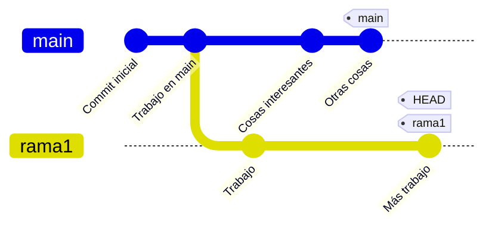
</div>

<hr class="border-gray-300 w-screen -ml-1/2 relative left-1/2" />

<div grid="~ cols-2 gap-30">

<div>
<br>
<div v-mark.highlight.yellow class="text-xl font-extrabold mb-4">
  Traer solo un commit con <span class="uppercase">cherry-pick</span>
</div>

```bash
# Moverse a la rama de destino
git checkout rama1

# Traer el commit concreto (ej: 4e3d2c1b)
git cherry-pick 4e3d2c1b
```
</div>

<div>
<br>

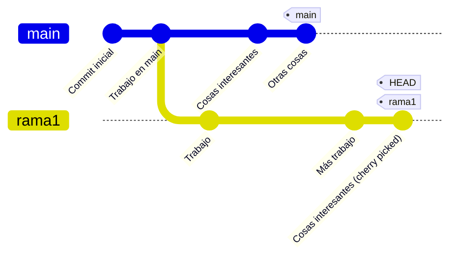
</div>

</div>

--- 

# Descartar cambios no confirmados: `git restore`

El comando `git restore` permite deshacer cambios __no confirmados__.

**Uso básico:**

- `git restore --staged <archivo>`: Descarta los cambios en el Staging Area, pero mantiene los cambios en el Working Directory.
- `git restore <archivo>`: Descarta los cambios realizados en el Working Directory, restaurándolo a su última versión confirmada. <span class="text-orange-500 font-semibold">__No funciona sobre cambios que ya estén en el Staging Area__.</span>

<br>

<div class="grid grid-cols-1 md:grid-cols-2 gap-4">
  <div>
    <div class="font-bold mb-2">Ejemplo: descartar del staging</div>
    <pre class="bg-gray-100 p-2 rounded text-sm"><code>git restore --staged slides.md</code></pre>
    <div class="text-xs text-gray-500 mt-1">El archivo permanece modificado, pero ya no está en el Staging Area.</div>
  </div>
  <div>
    <div class="font-bold mb-2">Ejemplo: descartar cambios locales</div>
    <pre class="bg-gray-100 p-2 rounded text-sm"><code>git restore slides.md</code></pre>
    <div class="text-xs text-gray-500 mt-1">Elimina los cambios no confirmados en <code>slides.md</code>.</div>
  </div>
</div>

---

# Guardar cambios temporales: `git stash`

<div grid="~ cols-2 gap-2" m="t-5">

<div>
  <div class="font-bold mb-2">¿Cuándo usar <code>git stash</code>?</div>
  <ul class="list-disc ml-5 text-sm">
    <li>Cuando necesitas cambiar de rama pero tienes cambios sin confirmar.</li>
    <li>Cuando quieres probar algo sin perder tu trabajo actual.</li>
  </ul>
  <br>
  <div class="font-bold mb-2">Comandos básicos:</div>
  <ul class="list-disc ml-5 text-sm">
    <li><code>git stash</code>: Guarda los cambios no confirmados y limpia el directorio de trabajo.</li>
    <li><code>git stash list</code>: Muestra la lista de stashes guardados.</li>
    <li><code>git stash apply</code>: Recupera el último stash (los cambios permanecen en la lista).</li>
    <li><code>git stash pop</code>: Recupera el último stash y lo elimina de la lista.</li>
  </ul>
</div>

<div>
  <div class="font-bold mb-2">Ejemplo de uso:</div>
  

```bash
# Guardar cambios actuales
git stash

# Cambiar de rama
git checkout main

# Recuperar los cambios guardados
git stash pop
```

  <div class="text-xs text-gray-500 mt-2">
    Puedes guardar múltiples stashes y recuperarlos cuando los necesites.
  </div>
</div>
</div>

<div class="absolute bottom-10 right-10 bg-blue-100 border-l-4 border-blue-500 text-blue-700 p-4 rounded shadow-lg max-w-xs text-sm">
  <span class="font-bold">Consejo:</span> Usa <code>git stash -u</code> para incluir archivos no rastreados (<code>untracked</code>) en el stash.
</div>

---

# Etiquetado de commits: `git tag`

El comando `git tag` permite asignar etiquetas (tags) a commits específicos, facilitando la identificación de versiones importantes (por ejemplo, lanzamientos).


<div class="grid grid-cols-1 md:grid-cols-2 gap-8 items-start mt-6">
  
  <div>
    <pre class="bg-gray-100 rounded text-sm"><code>
    git commit -m "Entrega inicial"
    git tag v1.0
    git commit -m "Añade documentación"
    git tag v1.1
    </code></pre>
  </div>
  
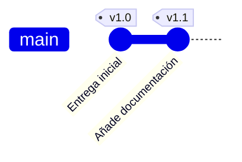

</div>

```bash
# Etiquetar el commit actual (HEAD) como v1.0
git tag v1.0

# Ver todas las etiquetas
git tag

# Mostrar información de una etiqueta
git show v1.0
```

---

# Moverse entre versiones

En Git, tanto las ramas (branches), las etiquetas (tags) como los identificadores de commit (hashes) son **punteros** que señalan a un commit concreto en el historial. Puedes moverte a cualquier commit usando cualquiera de estos punteros con `git checkout`.

<br>

<div grid="~ cols-2 gap-4" m="t-5">

```mermaid {scale:1}
gitGraph
  commit id: "Commit inicial" tag: "v1.0"
  commit id: "Añade README"
  branch feature
  checkout feature
  commit id: "Implementa feature" tag: "feature"
  checkout main
  commit id: "Corrige bug" tag: "v1.1" tag: "main"
```

<div>
  <div class="font-bold mb-2">Opciones de checkout:</div>
  <ul class="list-disc ml-5 text-sm">
    <li><code>git checkout main</code> &rarr; Moverse al ultimo commit de la rama <span class="font-semibold text-blue-600">main</span></li>
    <li><code>git checkout v1.0</code> &rarr; Moverse al commit etiquetado como <span class="font-semibold text-green-600">v1.0</span></li>
    <li><code>git checkout 1a2b3c4</code> &rarr; Moverse al commit con el hash <span class="font-semibold text-gray-700">1a2b3c4</span> (obtener el id con <code>git log</code>)</li>
  </ul>
  <br>
  <div class="text-sm text-gray-600">
    <span class="font-semibold">Nota:</span> Si haces checkout a un hash de commit que <b>NO</b> es el ultimo commit de una rama, entrarás en estado <code>DETACHED HEAD</code>.
  </div>
</div>

</div>

---

# Estado `DETACHED`

El estado `DETACHED` ocurre cuando `HEAD` no apunta al último `commit` de una rama. En este estado, los nuevos commits no pertenecen a ninguna rama.

<div grid="~ cols-2 gap-2" m="t-5">

<div>
  <div class="font-bold mb-2">¿Cómo se entra en modo detached?</div>
  <pre class="bg-gray-100 p-2 rounded text-sm"><code>git checkout 4e3d2c1b</code></pre>
  <div class="text-xs text-gray-500 mt-1">
    Esto mueve <code>HEAD</code> al commit indicado.
  </div>
  <br>
  <div class="font-bold mb-2">¿Qué ocurre con los commits?</div>
  <ul class="list-disc ml-5 text-sm">
    <li>Los commits hechos en este estado no están en ninguna rama.</li>
    <li>Si cambias de rama, esos commits pueden quedar inaccesibles.</li>
  </ul>
</div>

<div>
  <div class="font-bold mb-2">Recuperar commits perdidos</div>
  <ul class="list-disc ml-5 text-sm">
    <li>Usa <code>git reflog</code> para ver el historial de movimientos de <code>HEAD</code> y localizar el <code>commit</code> perdido.</li>
    <li>Asigna una rama al commit perdido:<br>
      <code>git checkout -b nueva-rama &lt;commit_id&gt;</code>
    </li> 
  </ul>
</div>
</div>

<div class="absolute bottom-10 left-8 bg-green-100 border-l-4 border-green-500 text-green-700 p-4 rounded shadow-lg max-w-md text-sm">
  <span class="font-bold">Consejo:</span> Si necesitas conservar los commits hechos en modo detached, crea una rama antes de salir de ese estado.
</div>

<div class="absolute bottom-5 right-5 bg-red-100 border-l-4 border-red-500 text-red-700 p-4 rounded shadow-lg max-w-xs text-sm z-10">
  <span class="font-bold">Aviso:</span> Evita trabajar en modo <code>DETACHED</code> salvo que sea estrictamente necesario. Puedes perder cambios si no creas una rama antes de salir de este estado.
</div>

---

# Deshacer commits: `git reset`

El comando `git reset` permite mover el puntero de la rama actual (`HEAD`) a un commit anterior, modificando el historial y el estado del directorio de trabajo según la opción utilizada.

```bash
# --soft: Mueve HEAD y la rama al commit anterior. Los cambios permanecen en el Staging Area.
git reset --soft HEAD~1 

# --mixed: Mueve HEAD y la rama al commit anterior. Los cambios permanecen en el Working Directory.
git reset --mixed HEAD~1

# --hard: Mueve HEAD y la rama al commit anterior. Los cambios se pierden.
git reset --hard HEAD~1 
```

<div grid="~ cols-2 gap-8" m="t-5">

<div>
  <div class="font-bold mb-2">Ejemplo: <code>reset --hard</code></div>
  <pre class="bg-gray-100 rounded text-xs"><code>
  git commit -m "Commit inicial"
  git commit -m "Añade README"
  git commit -m "Implementa función principal"
  git reset --hard HEAD~1
  </code></pre>
  <div class="text-xs text-gray-500 mt-2">
    El comando <code>git reset --hard HEAD~1</code> elimina el commit "Implementa función principal" y descarta todos los cambios posteriores a "Añade README".
  </div>
</div>

<div>
  <div class="font-bold mb-2">Grafo de commits tras el reset:</div>
```mermaid
gitGraph
  commit id: "Commit inicial"
  commit id: "Añade README" tag: "HEAD"
```
</div>
</div>

<div class="absolute bottom-5 right-5 bg-red-100 border-l-4 border-red-500 text-red-700 p-4 rounded shadow-lg max-w-xs text-sm z-10">
  <span class="font-bold">Aviso:</span> <code>git reset --hard</code> es <span class="font-semibold">destructivo</span>.
</div>

---

# Revertir commits: `git revert`

El comando `git revert` añade un commit nuevo que revierte los cambios de uno o varios commits anteriores (añade un `commit` *inverso*)

 ```bash
# Uso
git revert <ref>

# Revertir el último commit
git revert HEAD

# Revertir los últimos 2 commits (el commit izquierdo HEAD~2 no se incluye en el rango)
git revert HEAD~2..HEAD  
```

<div grid="~ cols-2 gap-8" m="t-5">

<div>
  <div class="font-bold">Ejemplo de uso:</div>
  <pre class="bg-gray-100 rounded text-xs"><code>
  git commit -m "Commit inicial"
  git commit -m "Añade README"
  git commit -m "Implementa función principal"
  git revert HEAD
  </code></pre>
  <div class="text-xs text-gray-500 mt-2">
    El comando <code>git revert HEAD</code> crea un nuevo commit que deshace los cambios del commit "Implementa función principal".
  </div>
</div>

<div>
  <div class="font-bold mb-2">Grafo de commits tras el revert:</div>

```mermaid
gitGraph
  commit id: "Commit inicial"
  commit id: "Añade README"
  commit id: "Implementa función principal"
  commit id: "Revert 'Implementa función principal'" type: REVERSE
```
</div>
</div>

---

# Eliminar ficheros del repositorio: `git rm`

El comando `git rm` se utiliza para eliminar archivos del repositorio. Permite tanto borrar físicamente el archivo del sistema de archivos como simplemente dejar de rastrearlo sin eliminarlo.

<br>

<div grid="~ cols-2 gap-2" m="t-5">

<div>
  <div class="font-bold mb-2">Eliminar archivo del repositorio y del disco</div>
  <pre class="bg-gray-100 p-2 rounded text-sm"><code>git rm archivo.txt
git commit -m "Elimina archivo.txt"</code></pre>
  <div class="text-xs text-gray-500 mt-1">
    El archivo se elimina del disco y del historial de Git en el próximo commit.
  </div>
</div>

<div>
  <div class="font-bold mb-2">Dejar se hacer seguimiento a un archivo, pero mantenerlo en disco</div>
  <pre class="bg-gray-100 p-2 rounded text-sm"><code>git rm --cached archivo.txt
git commit -m "Deja de rastrear archivo.txt"</code></pre>
  <div class="text-xs text-gray-500 mt-1">
    El archivo permanece en tu carpeta, pero Git deja de rastrearlo.
  </div>
</div>
</div>

<br>
<br>

- Usa <code>git rm</code> para borrar archivos completamente.
- Usa <code>git rm --cached</code> para dejar de rastrear archivos (por ejemplo, tras añadirlos a <code>.gitignore</code>).