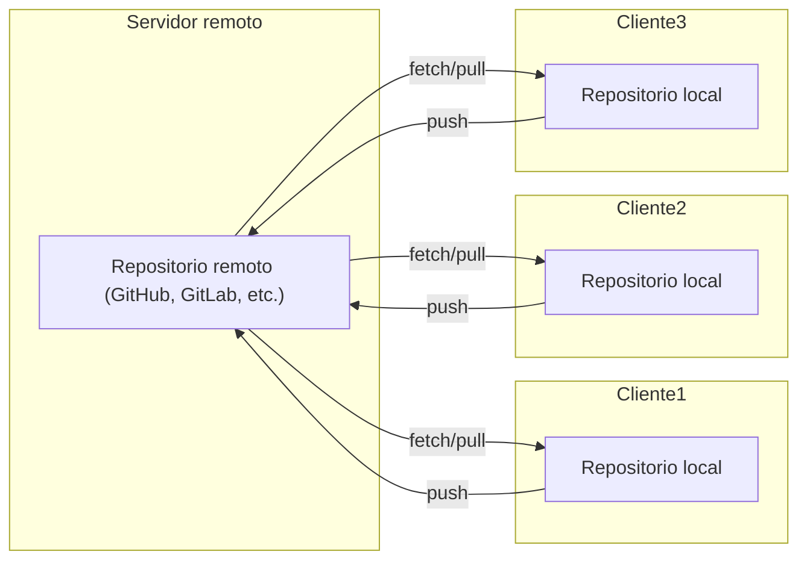
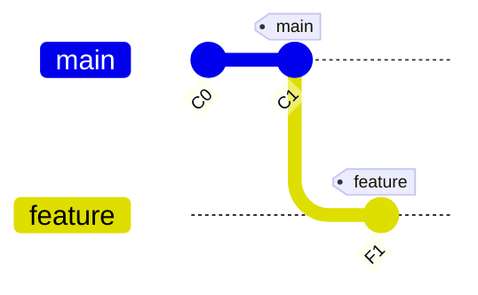
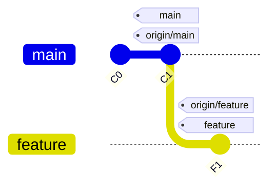
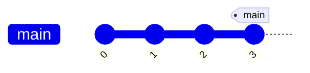
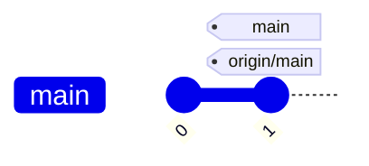
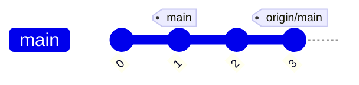
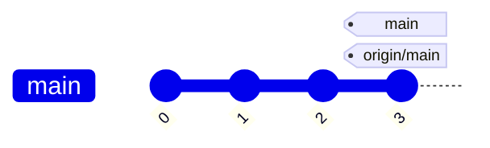
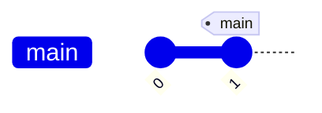
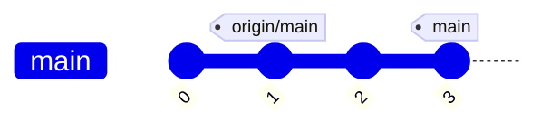

# Índice

<br>

1. Gestión de la configuración software  
2. <span style="color: red; font-weight: bold;">Control de versiones con Git</span>  
    - Repositorios locales
    - <span style="color: red; font-weight: bold;">Repositorios remotos</span>
3. Modelos organizativos con Git  

---


# ¿Qué es un repositorio remoto en Git?

- Un **repositorio remoto** es una repositorio Git alojado en un servidor o servicio externo (como GitHub, GitLab o Bitbucket).
- Permite la **colaboración** entre varios desarrolladores, facilitando el intercambio de cambios.
- Se accede a través de una URL (por ejemplo, `https://github.com/usuario/repositorio.git`).
- Los comandos principales para trabajar con repositorios remotos son:  
  - `git remote`: configurar repositorio remoto  
  - `git clone`: crear copia local de un repositorio remoto
  - `git fetch`: descargar nuevos cambios alojados en el repositorio remoto  
  - `git pull`: descargar y fusionar nuevos cambios alojados en el repositorio remoto  
  - `git push`: subir cambios locales al repositorio remoto
- Es fundamental para el trabajo en equipo y la gestión de versiones distribuidas.

---

# Repositorio remoto y repositorios locales

<br>

<div class="flex justify-center">



</div>

- El repositorio central actúa como punto de encuentro para los cambios.
- Cada cliente tiene su propio repositorio local y se sincroniza con el remoto mediante los comandos `push`, `pull` y `fetch`.

---

# `git clone`: clonar repositorio remoto

<GitCommand
  purpose="Crea una copia local exacta de un repositorio remoto, incluyendo todo el historial y ramas."
  when="Cuando quieres empezar a trabajar con un proyecto existente alojado en un servidor remoto (GitHub, GitLab, etc.)."
  command="git clone &lt;url-del-repositorio&gt; [directorio]"
  :parameters="[
    { 
      name: '&lt;url-del-repositorio&gt;', 
      description: 'Dirección del repositorio remoto' 
    },
    { 
      name: '[directorio]', 
      description: '(Opcional) Carpeta donde se creará el repositorio local' 
    }
  ]"
/>

--- 

# `git clone`: ejemplo

<GitStateComparison 
  firstColumnTitle="Situación inicial"
  secondColumnTitle="Después de <code>git clone &lt;url&gt;</code>"
  :localBefore="null"
>
  <template #remote-before>

  </template>
  
  <template #remote-after>

  </template>
  
  <template #local-after>

  </template>
</GitStateComparison>


---

# `git remote`: gestión del repositorio remoto

<GitCommand
  purpose="Gestiona las conexiones a repositorios remotos en tu proyecto Git."
  when="Cuando necesitas listar, añadir, eliminar o modificar referencias a repositorios remotos. No hace falta usarlo si has ejecutado <code>git clone</code> antes."
  command="git remote &lt;acción&gt; [parámetros]"
  :parameters="[
    { 
      name: '&lt;acción&gt;', 
      description: 'Operación a realizar: <code>add</code>, <code>remove</code>, <code>rename</code>, <code>show</code>, <code>-v</code> (listar)' 
    },
    { 
      name: '[parámetros]', 
      description: 'Dependen de la acción: nombre del remoto, URL, etc.' 
    }
  ]"
/>

---

# `git fetch`: descargar datos del remoto

<GitCommand
  purpose="Descarga los commits, ramas y etiquetas del repositorio remoto <b>sin fusionar los cambios en tu rama local</b>."
  when="Cuando quieres revisar los cambios del repositorio remoto antes de integrarlos en tu trabajo local."
  command="git fetch &lt;remoto&gt; [rama]"
  :parameters="[
    { 
      name: '&lt;remoto&gt;', 
      description: 'Nombre del repositorio remoto (normalmente <code>origin</code>)' 
    },
    { 
      name: '[rama]', 
      description: '(Opcional) Rama específica a descargar. Si se omite, descarga todas las ramas' 
    }
  ]"
/>

---

# Ejemplo de `git fetch` (1/2)

<br> 
<GitStateComparison 
  firstColumnTitle="Situación inicial"
  secondColumnTitle="Después de <code>git fetch origin main</code>"
  note="La rama local <code>main</code> no ha cambiado. Los nuevos commits están disponibles en <code>origin/main</code>."
  noteClass="absolute bottom-5 right-5 bg-yellow-100 dark:bg-yellow-900 border-l-4 border-yellow-500 dark:border-yellow-400 text-yellow-700 dark:text-yellow-300 p-4 rounded shadow-lg max-w-xs text-sm z-10"
>
  <template #remote-before>

  </template>
  
  <template #remote-after>

  </template>
  
  <template #local-before>

  </template>
  
  <template #local-after>

  </template>
</GitStateComparison>

---

# Ejemplo de `git fetch` (2/2)

Para integrar los commits descargados con `git fetch` hay que fusionar (`git merge`)

<br>

<GitStateComparison 
  firstColumnTitle="Después de <code>git fetch origin main</code>"
  secondColumnTitle="Después de <code>git merge origin/main</code>"
  note="La rama local <code>main</code> ahora contiene los commits nuevos."
  noteClass="absolute bottom-5 right-5 bg-green-100 dark:bg-green-900 border-l-4 border-green-500 dark:border-green-400 text-green-700 dark:text-green-300 p-4 rounded shadow-lg max-w-xs text-sm z-10"
>
  <template #remote-before>

  </template>
  
  <template #remote-after>

  </template>
  
  <template #local-before>

  </template>
  
  <template #local-after>

  </template>
</GitStateComparison>

---

# `git pull`: sincronizar con el remoto

<GitCommand
  purpose="Descarga los commits de la rama remota y los fusiona automáticamente con la rama local actual. Es equivalente a ejecutar <code>git fetch</code> y después <code>git merge</code>"
  when="Cuando quieres sincronizar tu rama local con los últimos cambios del repositorio remoto de forma rápida."
  command="git pull [remoto] [rama]"
  :parameters="[
    { 
      name: '[remoto]', 
      description: '(Opcional) Nombre del repositorio remoto (por defecto <code>origin</code>)' 
    },
    { 
      name: '[rama]', 
      description: '(Opcional) Rama remota a fusionar (por defecto la rama de seguimiento configurada)' 
    }
  ]"
/>

--- 

# Ejemplo de `git pull`

<br>

<GitStateComparison 
  firstColumnTitle="Situación inicial"
  secondColumnTitle="Después de <code>git pull origin main</code>"
  note="⚠️ Al hacerse una fusión de ramas, puede resultar en conflictos de fusión que deben ser resueltos manualmente si ambas ramas han modificado las mismas líneas."
  noteClass="absolute bottom-5 right-5 bg-orange-100 dark:bg-orange-900 border-l-4 border-orange-500 dark:border-orange-400 text-orange-700 dark:text-orange-300 p-4 rounded shadow-lg max-w-xs text-sm z-10"
>
  <template #remote-before>

</template>
<template #remote-after>

</template>
<template #local-before>

</template>
<template #local-after>

</template> </GitStateComparison>

---

# Resolución de conflictos en `git pull` 

Cuando `git pull` resulta en conflictos, Git pausa el proceso para que los resuelvas manualmente:

<div class="mt-6">
  <InfoBox 
    icon="⚙️" 
    title="Pasos para resolver conflictos" 
    content="1. Git marca los archivos en conflicto<br>2. Editas los archivos para resolver conflictos<br>3. <code>git add &lt;archivos-resueltos&gt;</code><br>4. <code>git commit</code> para completar la fusión" 
    color="blue" 
  />
</div>

<div class="absolute bottom-5 right-5 bg-yellow-100 border-l-4 border-yellow-500 text-yellow-700 p-4 rounded shadow-lg max-w-xs text-sm z-10 dark:bg-yellow-900/30 dark:border-yellow-400 dark:text-yellow-300">
  <h3 class="font-bold mb-1">💡 Tip</h3>
  <p>Usa <code>git status</code> para ver qué archivos tienen conflictos</p>
</div>

---

# `git push`: subir cambios al remoto

<GitCommand
  purpose="Envía los commits de tu rama local al repositorio remoto, actualizando la rama remota con tus cambios."
  when="Cuando has realizado commits locales y quieres compartirlos con otros desarrolladores o tener una copia de seguridad en el servidor."
  command="git push &lt;remoto&gt; &lt;rama&gt;"
  :parameters="[
    { 
      name: '&lt;remoto&gt;', 
      description: 'Nombre del repositorio remoto (normalmente <code>origin</code>)' 
    },
    { 
      name: '&lt;rama&gt;', 
      description: 'Nombre de la rama que quieres subir (ej: <code>main</code>)' 
    }
  ]"
/>

---

# Ejemplo de `git push`

<br>

<GitStateComparison 
  firstColumnTitle="Situación inicial"
  secondColumnTitle="Después de <code>git push origin main</code>"
  note="Los commits locales ahora están disponibles en el repositorio remoto para otros desarrolladores."
  noteClass="absolute bottom-5 right-5 bg-green-100 dark:bg-green-900 border-l-4 border-green-500 dark:border-green-400 text-green-700 dark:text-green-300 p-4 rounded shadow-lg max-w-xs text-sm z-10"
>
  <template #remote-before>

  </template>
  
  <template #remote-after>

  </template>
  
  <template #local-before>

  </template>
  
  <template #local-after>

  </template>
</GitStateComparison>

---

# `git push` cuando el remoto está desactualizado

Si intentas hacer `git push` cuando el repositorio remoto tiene commits que no tienes localmente, Git rechazará la operación. 

Los <em>commits</em> `C3` y `C4` fueron añadidos al remoto mientras creabas los <em>commits</em> `C2` y `C5` en local:

<GitStateComparison 
  firstColumnTitle="Situación: remoto desactualizado"
  secondColumnTitle="Error al hacer <code>git push origin main</code>"
  note="⚠️ Git rechaza el push para evitar perder los commits C3 y C4 del remoto. Primero hay que sincronizar con <code>git pull</code>."
  noteClass="absolute bottom-5 right-5 bg-red-100 dark:bg-red-900 border-l-4 border-red-500 dark:border-red-400 text-red-700 dark:text-red-300 p-4 rounded shadow-lg max-w-xs text-sm z-10"
>
  <template #remote-before>
```mermaid {scale:0.8}
gitGraph
  commit id: "C0"
  commit id: "C1"
  commit id: "C3"
  commit id: "C4" tag: "main"
```
  </template>
  
  <template #remote-after>
```mermaid {scale:0.8}
gitGraph
  commit id: "C0"
  commit id: "C1"
  commit id: "C3"
  commit id: "C4" tag: "main"
```
  </template>
  
  <template #local-before>
```mermaid {scale:0.8}
gitGraph
  commit id: "C0"
  commit id: "C1" tag: "origin/main"
  commit id: "C2"
  commit id: "C5" tag: "main"
```
  </template>
  
  <template #local-after>
```mermaid {scale:0.8}
gitGraph
  commit id: "C0"
  commit id: "C1" tag: "origin/main"
  commit id: "C2"
  commit id: "C5" tag: "main"
```
  </template>
</GitStateComparison>

<br>

---

# Sistemas Centralizados vs Distribuidos

<div grid="~ cols-2 gap-6" m="t-4">

<div class="bg-blue-50 dark:bg-blue-900/30 p-3 rounded-lg border-2 border-blue-200 dark:border-blue-700">

## <span class="text-blue-600 dark:text-blue-400">🏢 Centralizados</span>
**Un único servidor central**

<div class="mt-3">

### <span class="text-gray-700 dark:text-gray-300 text-sm">Características:</span>
<div class="bg-gray-50 dark:bg-gray-900/20 p-2 rounded-lg mt-1">
  <ul class="space-y-1 text-xs">
    <li>🏗️ <strong>Repositorio único</strong> en servidor central</li>
    <li>📸 <strong>Clientes solo tienen snapshots</strong></li>
    <li>🌐 <strong>Todas las operaciones requieren conexión</strong></li>
    <li>🔐 <strong>Control centralizado</strong> de permisos</li>
  </ul>
</div>

### <span class="text-blue-600 dark:text-blue-400 text-sm">Ejemplos:</span>
<div class="bg-blue-100 dark:bg-blue-900/20 p-2 rounded-lg mt-1">
  <div class="text-xs">
    <strong>SVN</strong>, <strong>CVS</strong>, <strong>Perforce</strong>, <strong>TFS</strong>
  </div>
</div>

</div>

</div>

<div class="bg-purple-50 dark:bg-purple-900/30 p-3 rounded-lg border-2 border-purple-200 dark:border-purple-700">

## <span class="text-purple-600 dark:text-purple-400">🌐 Distribuidos</span>
**Cada cliente es un repositorio completo**

<div class="mt-3">

### <span class="text-gray-700 dark:text-gray-300 text-sm">Características:</span>
<div class="bg-gray-50 dark:bg-gray-900/20 p-2 rounded-lg mt-1">
  <ul class="space-y-1 text-xs">
    <li>💾 <strong>Cada copia es un repositorio completo</strong></li>
    <li>✈️ <strong>Trabajo offline completo</strong></li>
    <li>🔄 <strong>Múltiples flujos</strong> de trabajo posibles</li>
    <li>🛡️ <strong>Redundancia natural</strong></li>
  </ul>
</div>

### <span class="text-purple-600 dark:text-purple-400 text-sm">Ejemplos:</span>
<div class="bg-purple-100 dark:bg-purple-900/20 p-2 rounded-lg mt-1">
  <div class="text-xs">
    <strong>Git</strong>, <strong>Mercurial</strong>, <strong>Bazaar</strong>, <strong>Darcs</strong>
  </div>
</div>

</div>

</div>

</div>

--- 

# Sistemas Centralizados vs Distribuidos


<div grid="~ cols-2 gap-6" m="t-4">

<div class="bg-blue-50 dark:bg-blue-900/30 p-3 rounded-lg border-2 border-blue-200 dark:border-blue-700">

## <span class="text-blue-600 dark:text-blue-400">🏢 Centralizados</span>

<div class="mt-3">

### <span class="text-green-600 dark:text-green-400 text-sm">✅ Ventajas:</span>
<div class="bg-green-50 dark:bg-green-900/20 p-2 rounded-lg mt-1">
  <ul class="space-y-1 text-xs">
    <li>🎯 <strong>Simplicidad conceptual</strong>: un solo punto de verdad</li>
    <li>⚙️ <strong>Administración centralizada</strong>: backups, usuarios</li>
    <li>💾 <strong>Menos espacio</strong>: clientes solo tienen snapshot</li>
  </ul>
</div>

### <span class="text-red-600 dark:text-red-400 text-sm">❌ Inconvenientes:</span>
<div class="bg-red-50 dark:bg-red-900/20 p-2 rounded-lg mt-1">
  <ul class="space-y-1 text-xs">
    <li>💥 <strong>Punto único de fallo</strong>: si cae el servidor, nadie puede trabajar</li>
    <li>🌐 <strong>Dependencia de red</strong>: todas las operaciones requieren conexión</li>
  </ul>
</div>

</div>

</div>

<div class="bg-purple-50 dark:bg-purple-900/30 p-3 rounded-lg border-2 border-purple-200 dark:border-purple-700">

## <span class="text-purple-600 dark:text-purple-400">🌐 Distribuidos</span>

<div class="mt-3">

### <span class="text-green-600 dark:text-green-400 text-sm">✅ Ventajas:</span>
<div class="bg-green-50 dark:bg-green-900/20 p-2 rounded-lg mt-1">
  <ul class="space-y-1 text-xs">
    <li>✈️ <strong>Trabajo offline</strong>: historial completo local</li>
    <li>🔄 <strong>Redundancia</strong>: cada copia es un backup completo</li>
    <li>⚡ <strong>Branching eficiente</strong>: crear ramas es instantáneo</li>
  </ul>
</div>

### <span class="text-red-600 dark:text-red-400 text-sm">❌ Inconvenientes:</span>
<div class="bg-red-50 dark:bg-red-900/20 p-2 rounded-lg mt-1">
  <ul class="space-y-1 text-xs">
    <li>📚 <strong>Complejidad</strong>: curva de aprendizaje más pronunciada</li>
    <li>💿 <strong>Espacio</strong>: cada copia incluye todo el historial</li>
  </ul>
</div>

</div>

</div>

</div>

<div class="absolute bottom-15 right-15 bg-gradient-to-r from-blue-100 to-purple-100 dark:from-blue-900/50 dark:to-purple-900/50 border border-blue-300 dark:border-purple-600 text-blue-800 dark:text-blue-200 p-2 rounded-lg shadow-lg text-xs z-10">
  <span class="font-bold">💡 En la práctica:</span> <b>Git</b> es el estándar de la industria
</div>