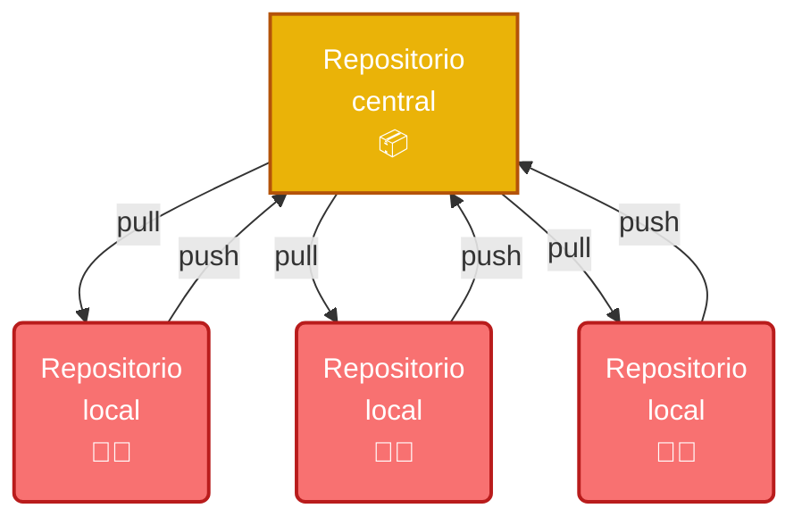
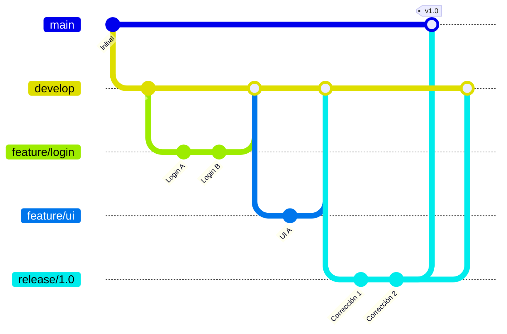
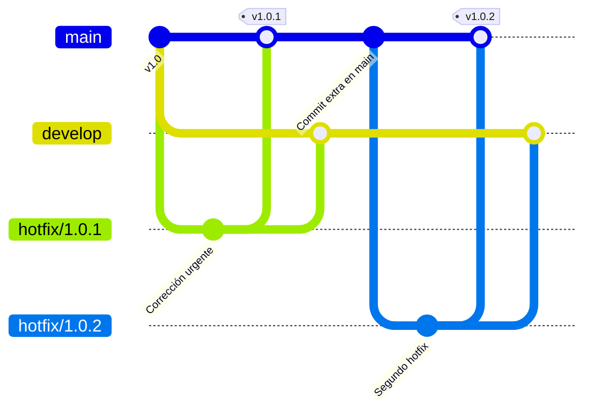
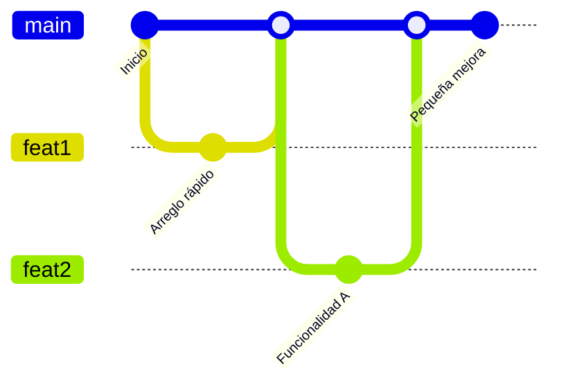

# Índice

 

1. Gestión de la configuración software  
2. Control de versiones con Git  
3. Modelos organizativos con Git  

---

# Centralizado Clásico

  

  Modelo tradicional y habitual. Hay un único repositorio central donde todos los desarrolladores sincronizan su trabajo (push/pull).

<!-- https://git-scm.com/book/en/v2/Distributed-Git-Distributed-Workflows -->

---

# Modelo de Integrador Destacado

  

  Este es el modelo de <b>GitHub</b>: cada desarrollador trabaja en su propio <b>Fork</b> (repositorio público personal), y propone cambios mediante <b>Pull Requests</b> al repositorio principal.

<!-- https://git-scm.com/book/en/v2/GitHub-Forks-Branches-and-Merges-in-a-Nutshell -->

---

# Modelo Dictador y Tenientes

  

  En este modelo, un <b>Dictador</b> (mantenedor principal) integra los cambios propuestos por un grupo reducido de <b>Tenientes</b>, quienes a su vez reciben contribuciones del resto de desarrolladores.

  

    
  

---

# Git Flow

  <DefinicionCompacta title="main" emoji="🚀">Rama de producción, siempre estable.</DefinicionCompacta>
  <DefinicionCompacta title="develop" emoji="🛠️">Rama de integración de desarrollo.</DefinicionCompacta>
  <DefinicionCompacta title="feature/*" emoji="✨">Nuevas funcionalidades o mejoras.</DefinicionCompacta>
  <DefinicionCompacta title="release/*" emoji="🔖">Preparación de una nueva versión estable.</DefinicionCompacta>

  Referencia original: <a href="https://nvie.com/posts/a-successful-git-branching-model/" target="_blank" class="underline text-blue-700">nvie.com/posts/a-successful-git-branching-model/</a>

---

# Git Flow: Hotfix

  <DefinicionCompacta title="main" emoji="🚀">Rama de producción, siempre estable.</DefinicionCompacta>
  <DefinicionCompacta title="hotfix/*" emoji="🧯">Corrección urgente sobre producción.</DefinicionCompacta>

  Un <b>hotfix</b> permite corregir errores críticos en producción rápidamente, integrando los cambios tanto en <code>main</code> como en <code>develop</code>, sin necesidad de crear una rama <code>feature</code>.

---

# Trunk-based Development

  <DefinicionCompacta title="main" emoji="🌳">Rama principal, todos los cambios se integran aquí frecuentemente.</DefinicionCompacta>
  <DefinicionCompacta title="featx" emoji="✨">Ramas de <b>muy corta duración</b> para implementar cambios</DefinicionCompacta>

  Integración continua real: ramas cortas, cambios frecuentes en <code>main</code>.

