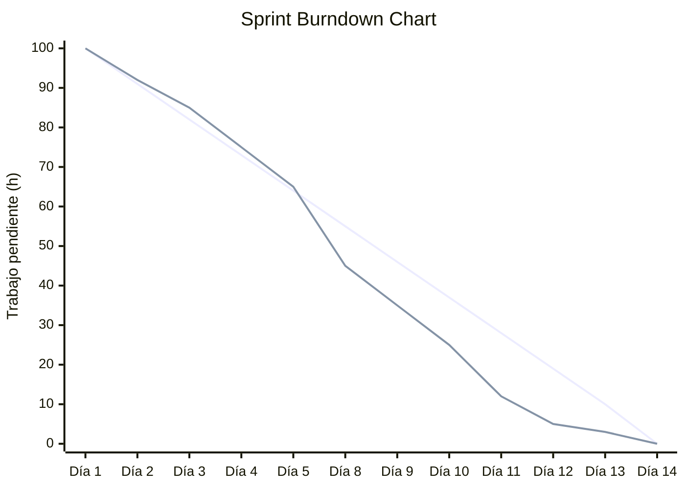
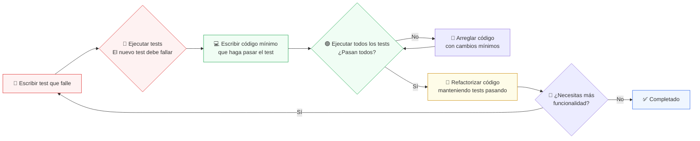

 
## Tema 2
# Metodologías de Desarrollo de Software Ágiles

 

#### Métodos de Desarrollo

  
    Juan M Rivas (rivasjm@unican.es)
  

---

# Objetivos

 

  

    🎯
    Principios básicos de metodologías ágiles
  

  

    🔄
    Técnicas comunes en desarrollo ágil
  

  

    ⚙️
    Principales metodologías ágiles y sus características
  

  

    🏆
    Desarrollar proyectos con Scrum
  

---

# Bibliografía

  <ReferenciaBibliograficaSimple
    titulo="The Scrum Guide - The Definitive Guide to Scrum: The Rules of the Game"
    autor="Schwaber, K. and Sutherland, J."
  />
  <ReferenciaBibliograficaSimple
    titulo="User Stories Applied"
    autor="Cohn, M."
    año="2004"
    edicion="Addison-Wesley"
  />
  <!-- Nuevas referencias -->
  <ReferenciaBibliograficaSimple
    titulo="Lean Software Development: An Agile Toolkit"
    autor="Poppendieck, M. and Poppendieck, T."
    año="2003"
    edicion="Addison-Wesley"
  />
  <ReferenciaBibliograficaSimple
    titulo="Kanban: Successful Evolutionary Change for Your Technology Business"
    autor="Anderson, D. J. and Reinertsen, D. G."
    año="2010"
    edicion="Blue Hole Press"
  />
  <ReferenciaBibliograficaSimple
    titulo="Software Engineering"
    autor="Sommerville, I."
    año="2016"
    edicion="Addison Wesley, 10a edición"
  />

---

# Índice

1. **Concepto de Metodología Ágil**
2. **Lean**
3. **Scrum**
4. **Técnicas y Herramientas Ágiles**
5. **Otras Metodologías Ágiles**
6. **Sumario**

---

# Índice

1. Concepto de Metodología Ágil
    - Metodologías Ágiles y Metodologías No Ágiles
    - Manifiesto Ágil
    - Limitaciones de las Metodologías Ágiles
2. **Lean**
3. **Scrum**
4. **Técnicas y Herramientas Ágiles**
5. **Otras Metodologías Ágiles**
6. **Sumario**

---

# Metodologías Planificadas vs Ágiles

<DefinicionSimple title="Metodologías Fuertemente Planificadas" color="blue" mt="12">
  Se basan en la definición de un plan de trabajo al cual debemos de adherirnos y que es complejo o difícil de cambiar. Suele tener roles y procesos claramente definidos.
</DefinicionSimple>

<DefinicionSimple title="Metodologías Ágiles" color="purple" mt="12">
  Se basan en una organización del trabajo que permita la definición de planes de trabajo, procesos y productos fácilmente modificables en función de las <b>demandas de los usuarios</b>, con los cuales se debe mantener un permanente contacto y proporcionarles con frecuencia versiones parciales y operativas del software desarrollado.
</DefinicionSimple>

---

# Manifiesto Ágil : 4 Pilares

 
 
 

  

    🙋‍♂️
     Personas e interacciones personales
     
    sobre procesos y herramientas.
  

  

    💻
     Software operativo
     
    antes que extensos modelos software.
  

  

    🤝
     Colaboración con el cliente
     
    frente a renegociaciones de contrato.
  

  

    🔄
     Ser capaz de responder al cambio
     
    antes que seguir un plan fijo.
  

 
 

[Ver el Manifiesto Ágil](https://agilemanifesto.org/)

---

# Manifiesto Ágil: 12 Principios (1-6)

  

    😊
    

      Satisfacción del cliente
      
Entregas tempranas y continuas de software operativo.

    

  

  

    🔄
    

      Los cambios son bienvenidos
      
Incluso en etapas avanzadas del desarrollo.

    

  

  

    🚀
    

      Entregar software operativo frecuentemente
      
Desde semanas hasta meses, preferiblemente en períodos cortos.

    

  

  

    🤝
    

      Colaboración diaria
      
Gestores y desarrolladores colaboran durante todo el proyecto.

    

  

  

    🌟
    

      Individuos motivados
      
Darles entorno, apoyo y confianza para realizar el trabajo.

    

  

  

    🗣️
    

      Comunicación cara a cara
      
La forma más eficiente y efectiva de comunicar información.

    

  

[Fuente: https://agilemanifesto.org/principles.html](https://agilemanifesto.org/principles.html)

---

# Manifiesto Ágil: 12 Principios (7-12)

  

    📈
    

      Indicador de avance
      
El principal indicador es la cantidad de software operativo entregado.

    

  

  

    🔋
    

      Desarrollo sostenible
      
El desarrollo software debería ser sostenible.

    

  

  

    🏅
    

      Excelencia técnica
      
La excelencia técnica y los buenos diseños facilitan la agilidad.

    

  

  

    🧩
    

      Simplicidad
      
Maximizar el trabajo a no hacer es <a href="https://medium.com/@webseanhickey/the-evolution-of-a-software-engineer-db854689243" target="_blank">primordial</a>.

    

  

  

    🛠️
    

      Equipos autoorganizados
      
Las mejores arquitecturas y diseños emergen de equipos autoorganizados.

    

  

  

    🔍
    

      Reflexión periódica
      
El equipo debe reflexionar periódicamente sobre su eficiencia y productividad.

    

  

[Fuente: https://agilemanifesto.org/principles.html](https://agilemanifesto.org/principles.html)

---
layout: statement
---

# ¿Qué problemas se os ocurre que puede tener la metodología ágil?

---

# ⚠️ Limitaciones de las Metodologías Ágiles

  

    🧑‍💼
    

      Involucrar al cliente
      
Requiere participación activa y continua del cliente.

    

  

  

    🤝
    

      Actitud cooperativa
      
Es imprescindible una personalidad colaborativa en el equipo.

    

  

  

    🛠️
    

      Habilidades técnicas
      
El equipo debe tener competencias técnicas adecuadas.

    

  

  

    📋
    

      Identificación de prioridades
      
Puede ser difícil definir prioridades e incrementos de software.

    

  

  

    🧹
    

      Mantener la simplicidad
      
Evitar el simple parcheo y mantener soluciones simples.

    

  

  

    📑
    

      Problemas contractuales
      
Dificultades en la definición de contratos y alcance del proyecto.

    

  

---

# Principales Tipos de Metodologías Ágiles

  

    🏃‍♂️
    Scrum
    Gestión de proyectos basada en sprints, roles definidos y reuniones periódicas.
  

  

    📋
    Kanban
    Visualización del flujo de trabajo con tableros y gestión continua de tareas.
  

  

    💡
    Lean
    Enfocado en la eficiencia, reducción de desperdicio y mejora continua.
  

  

    👨‍💻
    EXtremeProgramming
    Prácticas técnicas como desarrollo iterativo, integración continua y programación en pareja.
  

  Según el <a href="https://stateofagile.com/" target="_blank">17th State of Agile Report</a>:
  <ul class="list-disc ml-5 mt-2">
    <li>El 71% de las organizaciones usan metodologías ágiles.</li>
    <li>Dentro de Agile, el 63% utilizan <b>Scrum</b> como marco principal.</li>
  </ul>

---

# Índice

1. **Concepto de Metodología Ágil**
2. Lean
3. **Scrum**
4. **Técnicas y Herramientas Ágiles**
5. **Otras Metodologías Ágiles**
6. **Sumario**

---

# Metodología <b>Lean</b>: Principios Fundamentales

 

<table class="w-full text-yellow-900 text-sm rounded overflow-hidden shadow-lg">
  <tbody>
    <tr class="bg-yellow-50">
      <td class="py-2 px-4 font-bold">Eliminar los desperdicios</td>
      <td class="py-2 px-4">Evitar tareas, procesos y recursos innecesarios.</td>
    </tr>
    <tr>
      <td class="py-2 px-4 font-bold">Fomentar el aprendizaje</td>
      <td class="py-2 px-4">Aprender de la experiencia y mejorar continuamente. Entender al cliente.</td>
    </tr>
    <tr class="bg-yellow-50">
      <td class="py-2 px-4 font-bold">Postergar las decisiones</td>
      <td class="py-2 px-4">Tomar decisiones importantes lo más tarde posible, con la mayor información disponible.</td>
    </tr>
    <tr>
      <td class="py-2 px-4 font-bold">Entregas rápidas</td>
      <td class="py-2 px-4">Realizar entregas tan rápido como sea posible para obtener feedback temprano.</td>
    </tr>
    <tr class="bg-yellow-50">
      <td class="py-2 px-4 font-bold">Delegar responsabilidades</td>
      <td class="py-2 px-4">El equipo debe tener autonomía y capacidad de decisión.</td>
    </tr>
    <tr>
      <td class="py-2 px-4 font-bold">Fomentar la integridad</td>
      <td class="py-2 px-4">Mantener la calidad y cohesión tanto del producto como del equipo.</td>
    </tr>
    <tr class="bg-yellow-50">
      <td class="py-2 px-4 font-bold">Visión global</td>
      <td class="py-2 px-4">Facilitar la comprensión del conjunto y el impacto de cada parte.</td>
    </tr>
  </tbody>
</table>

 

  Referencia: <i>Lean Software Development: An Agile Toolkit</i>, Mary & Tom Poppendieck, Addison-Wesley, 2003.

---

# Índice

1. **Concepto de Metodología Ágil**
2. **Lean**
3. Scrum
    - Roles en Scrum
    - Esquema de Scrum
    - Conceptos y Técnicas de Scrum
4. **Técnicas y Herramientas Ágiles**
5. **Otras Metodologías Ágiles**
6. **Sumario**

---

# Conceptos básicos de Scrum

  

    📦
    Marco de trabajo ágil
    Scrum es un marco para gestionar proyectos complejos, especialmente software.
  

  

    ⏳
    Sprints
    Ciclos cortos donde se entrega valor incrementalmente.
  

  

    👥
    Roles definidos
    Scrum Team, Product Owner, Scrum Master.
  

  

    📅
    Eventos clave definidos
    Planificación del sprint, reuniones diarias y retrospectivas.
  

<!-- agil no significa que no haya ningún proceso establecido o una anarquía -->

---

# Roles en Scrum

  

    <!-- Scrum Team - Arriba -->
    

      

        
          👥 Scrum Team
        
        

          Equipo multidisciplinar que desarrolla el producto. Todos son iguales (Bus Factor).
        

        

          Incluye todos los miembros necesarios para entregar incrementos de producto potencialmente entregables en cada sprint. 
        

      

    

    <!-- Product Owner - Abajo más a la izquierda -->
    

      

        
          🧑‍💼 Product Owner
        
        

          Define prioridades y requisitos, representa al cliente.
        

        

          Su principal responsabilidad es maximizar el valor del producto resultante del trabajo del Equipo de Desarrollo, gestionando el backlog.
        

      

    

    <!-- Scrum Master - Abajo más a la derecha -->
    

      

        
          🧑‍🏫 Scrum Master
        
        

          Facilita el proceso, elimina impedimentos y fomenta la mejora continua.
        

        

          Ayuda a todos a comprender y adoptar la teoría, las prácticas, las reglas y los valores de Scrum.
        

      

    

  

---

# Proceso de desarrollo Scrum

  

  <a href="https://github.com/isunican/docsProyectoIntegrado/wiki/actividadesScrum" target="_blank">https://github.com/isunican/docsProyectoIntegrado/wiki/actividadesScrum</a>

---

# Conceptos clave en Scrum

  

    1️⃣ Velocidad del equipo
    Cantidad de trabajo (p.ej. puntos de historia) que el equipo puede completar en un sprint. Permite estimar la capacidad y planificar futuros sprints.
  

  

    2️⃣ Definición de Completado
    Criterios claros que debe cumplir una tarea para considerarse realmente terminada (ej: código revisado, probado, documentado y desplegado).
    

      <a href="https://github.com/isunican/docsProyectoIntegrado/wiki/definicionCompletado" target="_blank" class="text-blue-600 underline">Definición de Completado en el Proyecto Integrado</a>
    

  

  

    3️⃣ Release Backlog
    Lista priorizada de funcionalidades y tareas que se espera entregar en una versión concreta del producto.
  

  

    4️⃣ Product Backlog Refinement
    Proceso continuo de revisión, clarificación y priorización de los elementos del Product Backlog para asegurar que estén listos para ser abordados en futuros sprints.
  

---

# Sprint Burndown Chart

  

    <DefinicionCompacta title="Sprint Burndown Chart" emoji="📉">
      Gráfico que muestra el trabajo pendiente a lo largo del <b>sprint</b>. 
      Permiten visualizar el progreso y detectar desviaciones respecto a la planificación.
    </DefinicionCompacta>
  

  
  

  

---

# Índice

1. **Concepto de Metodología Ágil**
2. **Lean**
3. **Scrum**
4. Técnicas y Herramientas Ágiles
    - Historias de Usuario
    - Juego de la Planificación
    - Sprint y Spike
    - Desarrollo Basado en Pruebas
    - Programación por Pares
5. **Otras Metodologías Ágiles**
6. **Sumario**

---

# Historia de Usuario

<DefinicionSimple title="Historia de Usuario" color="yellow" class="mb-6">
  Una historia de usuario describe una funcionalidad del sistema que posee valor para algún stakeholder. 
  Es la unidad básica de trabajo en metodologías ágiles.
</DefinicionSimple>

 
<b>Compuesto de los siguientes 3 elementos:</b>

  

    🗂️
    Tarjeta
    Cada historia se anota en una tarjeta física o digital, recordando que debe ser realizada.
  

  

    💬
    Conversación
    Diálogos entre usuarios, clientes, desarrolladores y testers para aclarar detalles y requisitos. Parte de estas conversaciones puede documentarse.
  

  

    ✅
    Confirmación
    Procedimiento para verificar que la historia se ha realizado correctamente (criterios de aceptación).
  

---

# Propiedades deseables de una Historia de Usuario

  🎯
  <h3 class="text-xl font-bold text-gray-700 mt-2">Una buena historia de usuario debe ser...</h3>

  

    🔄
    

      Independiente
      
No debe depender de otras historias para poder desarrollarse e implementarse.

    

  

  

    💬
    

      Negociable
      
Los detalles pueden discutirse y modificarse.

    

  

  

    ⭐
    

      Añade valor
      
Debe proporcionar valor real y tangible al usuario o stakeholder.

    

  

  

    📏
    

      Estimable
      
El equipo debe poder estimar el esfuerzo necesario para desarrollarla.

    

  

  

    🧩
    

      Pequeñas
      
Deben ser lo suficientemente pequeñas para completarse en un sprint.

    

  

  

    ✅
    

      Verificable
      
Debe ser posible comprobar que la funcionalidad cumple los criterios de aceptación.

    

  

---

# Historia Épica (Epic)

<DefinicionSimple title="Historia Épica (Epic)" color="red" class="mt-12 mb-4">
  Una historia épica es una historia que por su <b>tamaño no puede ser desarrollada en un periodo corto de tiempo</b>, por lo que ha de ser <b>descompuesta en historias de usuario de menor tamaño</b>.
</DefinicionSimple>

  <!-- Columna 1: historia épica -->
  

    

      📚
      Historia épica
      Demasiado grande para un sprint
    

  

  <!-- Columna 2: flecha -->
  

    ➡️
  

  <!-- Columna 3: historias de usuario -->
  

    

      📝
      Historia 1
      Sprint-sized
    

    

      📝
      Historia 2
      Sprint-sized
    

    

      📝
      Historia 3
      Sprint-sized
    

    

      📝
      Historia 4
      Sprint-sized
    

  

---

# Precisión y Esfuerzo en las Estimaciones

  

---

# Principios de la Estimación Ágil

  

    🤝
    

      1️⃣ Estimaciones compartidas y consensuadas
      Las estimaciones deben ser realizadas por todo el equipo de desarrollo, no por una sola persona. El consenso mejora la precisión y aumenta el compromiso del equipo.
    

  

  

    🔢
    

      2️⃣ Escala discreta (Fibonacci Modificada)
      Utilizar valores de la secuencia de Fibonacci modificada (0, 0.5, 1, 2, 3, 5, 8, 13, 20, 40, 100) para evitar falsas precisiones
      

        0
        0.5
        1
        2
        3
        5
        8
        13
        20
        40
        100
      

    

  

---

# 🃏 Planning Poker: El Proceso (1-4)

  <h3 class="text-xl font-bold text-gray-700 mt-2">Técnica colaborativa para estimación</h3>

  

    1️⃣
    

      Reunir al equipo 
      Se reúne al equipo de desarrollo completo.
    

  

  

    2️⃣
    

      Distribir cartas 
      Cada miembro recibe cartas con los valores de la escala de estimación (fibonacci).
    

  

  

    3️⃣
    

      Presentar elemento 
      El moderador presenta el elemento a estimar.
    

  

  

    4️⃣
    

      Aclarar dudas 
      Los miembros piden aclaraciones si es necesario.
    

  

---

# 🃏 Planning Poker: El Proceso (5-8)

  

    5️⃣
    

      Estimación privada 
      Cada miembro escoge una carta con su estimación, manteniéndola oculta.
    

  

  

    6️⃣
    

      Revelar cartas 
      Cuando todos han estimado, se muestran las cartas simultáneamente.
    

  

  

    7️⃣
    

      Discutir diferencias 
      Si hay variaciones significativas, se discuten brevemente y se vuelve al paso 5.
    

  

  

    8️⃣
    

      Consenso final 
      Si no hay diferencias significativas, se selecciona el valor consensuado.
    

  

  🎯 Objetivo: 
  Obtener estimaciones más precisas aprovechando la sabiduría colectiva del equipo y evitando el sesgo de anclaje.

---

# Ejemplo Visual: Planning Poker en Acción

  🎲🃏
  <h3 class="text-xl font-bold text-gray-700 mt-12">Historia: "Yo como usuario quiero poder ordenar las películas por su fecha de estreno"</h3>

  <!-- Primera ronda -->
  

    

      Primera ronda - Cartas reveladas:
    

    

      

        
Ana

        
3

      

      

        
Carlos

        
8

      

      

        
María

        
5

      

      

        
Jorge

        
5

      

    

    

      ⚠️ Diferencias significativas → Discusión
    

  

  <!-- Segunda ronda -->
  

    

      Segunda ronda - Después de la discusión:
    

    

      

        
Ana

        
5

      

      

        
Carlos

        
5

      

      

        
María

        
5

      

      

        
Jorge

        
3

      

    

    

      ✅ Consenso: 5 puntos de historia
    

  

---

# Sprint y Spike

  

    <Definicion title="Sprint" emoji="🏃‍♂️">
      Un <b>sprint</b> es una iteración de duración concreta y corta, al final de la cual se produce software potencialmente entregable.
    </Definicion>
    

      ⏳ Duración típica: 1 a 4 semanas 
      🎯 Objetivo: Entregar valor al usuario de forma incremental y frecuente.
    

  

  

    <Definicion title="Spike" emoji="🧪">
      Un <b>spike</b> es una iteración en la que no se libera nuevo código instalable o probado por usuarios. Se utiliza para experimentar, investigar, aprender nuevas tecnologías, probar algoritmos, generar documentación o productos de marketing.
    </Definicion>
    

      🔍 Usos: Investigación técnica, prototipos, formación, documentación, marketing.
    

  

---

# Desarrollo Dirigido por Pruebas (TDD)

<DefinicionSimple title="Test-Driven Development" color="blue" class="mt-12 mb-6">
  Es una práctica de desarrollo de software que invierte el proceso tradicional: primero se escriben las pruebas automatizadas y luego el código que las satisface.
</DefinicionSimple>

---

# Programación por Pares

<DefinicionSimple title="Programación por Pares" emoji="👥">
  Se codifica por parejas, donde una persona escribe el código y la otra persona supervisa y aporta ideas. Los roles se permutan con frecuencia.
</DefinicionSimple>

  <!-- Imagen conceptual -->
  

    
👨‍💻👩‍💻

    

      Driver + Navigator 
      Roles intercambiables
    

  

  
  <!-- Beneficios -->
  

    

      🐛
      

        Menos errores en el código. 
      

    

    

      📦
      

        Código más conciso y eficiente. 
      

    

    

      🔄
      

        Se detectan más refactorizaciones posibles. 
      

    

    

      🔍
      

        Revisión continua. El observador revisa el código. 
      

    

    

      🤝
      

        El código no pertenece a una sola persona. 
      

    

  

---

# Índice

1. **Concepto de Metodología Ágil**
2. **Lean**
3. **Scrum**
4. **Técnicas y Herramientas Ágiles**
5. Otras Metodologías Ágiles
    - Kanban
    - Extreme Programming (XP)
6. **Sumario**

---

# Metodología Kanban

<DefinicionSimple title="Kanban" emoji="📋">
  Sistema visual de gestión del flujo de trabajo que busca encontrar un ritmo de trabajo sostenible y óptimo mediante la limitación del trabajo en progreso.
</DefinicionSimple>

  

    🎯 Objetivo Principal
    Encontrar un ritmo de trabajo sostenible y óptimo.
  

  
  

    🔗 Base Teórica
    Aplica la Teoría de las Restricciones para optimizar el flujo.
  

  
  

    🚧 Identificación
    Busca identificar y eliminar cuellos de botella en los procesos.
  

  
  

    👁️ Visualización
    Para identificar cuellos de botella, debemos visualizar el proceso.
  

---

# Filosofía Kanban

Gestión basada en recursos y capacidades

  

    👥
    

      1️⃣ Recursos del equipo
      El equipo dispone de recursos para realizar el trabajo.
    

  

  

    ⚡
    

      2️⃣ Capacidad determinada
      Cada recurso tiene una capacidad limitada.
    

  

  

    🎫
    

      3️⃣ Señalización de capacidad
      Si hay capacidad libre, se libera una tarjeta para admitir más trabajo.
    

  

  

    🚫
    

      4️⃣ Control de saturación
      Sin capacidad libre, no se pueden solicitar más tareas.
    

  

---

# 🎫 Método Kanban: Implementación práctica

  

    1️⃣
    

      Tarjetas de tareas
      Las tareas a realizar se escriben en tarjetas que representan unidades de trabajo.
    

  

  

    2️⃣
    

      Capacidad por recurso
      Cada miembro del equipo puede admitir un número determinado de tarjetas simultáneas.
    

  

  

    3️⃣
    

      WIP limitado
      La cantidad de trabajo en progreso (Work In Progress) es limitada.
    

  

  

    4️⃣
    

      Señalización de disponibilidad
      Cuando un recurso puede admitir más trabajo, debe señalarse para asignación.
    

  

---

# Ejemplo de Tablero Kanban

  <!-- Columna To Do -->
  

    
📝 To Do

    

      

        
Tarea #1

        
Login usuario

      

      

        
Tarea #2

        
Base de datos

      

      

        
Tarea #3

        
API REST

      

    

  

  <!-- Columna In Progress -->
  

    
⚙️ In Progress

    

      

        
Tarea #4

        
Dashboard

        
👤 Ana

      

      

        
Tarea #5

        
Tests unitarios

        
👤 Carlos

      

    

  

  <!-- Columna Review -->
  

    
👀 Review (1/2)

    

      

        
Tarea #6

        
Autenticación

        
👤 María

      

    

  

  <!-- Columna Done -->
  

    
✅ Done

    

      

        
Tarea #7

        
Configuración

      

      

        
Tarea #8

        
Documentación

      

    

  

---

# Tablero Kanban físico

  

---

# Tablero Kanban físico

  

---

# Tablero Kanban virtual (Jira)

  

  

---

# Tablero Kanban virtual (Scrumdesk)

  

  

---

# Propiedades Fundamentales de Kanban

  <ol class="space-y-2 text-lg">
    <li class="flex items-start gap-3">
      1.
      

        Limitar el Work In Progress
        
Establecer límites claros en la cantidad de trabajo simultáneo.

      

    </li>
    <li class="flex items-start gap-3">
      2.
      

        Visualizar el flujo de trabajo
        
Hacer visible todo el proceso mediante tableros Kanban.

      

    </li>
    <li class="flex items-start gap-3">
      3.
      

        Medir y optimizar
        
Recoger métricas para mejorar continuamente el flujo.

      

    </li>
    <li class="flex items-start gap-3">
      4.
      

        Reglas explícitas
        
Definir y comunicar claramente las reglas de trabajo.

      

    </li>
    <li class="flex items-start gap-3">
      5.
      

        Gestión basada en métricas
        
Usar datos cuantitativos para tomar decisiones de mejora.

      

    </li>
  </ol>

---

# Extreme Programming (XP)

<DefinicionSimple title="Extreme Programming (XP)" emoji="👨‍💻">
  XP es una metodología ágil basada en prácticas concretas y disciplinadas para lograr excelencia técnica y satisfacción del cliente mediante colaboración intensa, ciclos de feedback rápidos y mejora continua.
</DefinicionSimple>

  

    
📊 Planificación y Gestión

    <ul class="list-disc ml-5 text-blue-700 text-sm space-y-1">
      <li><b>Historias de Usuario:</b> Requisitos escritos como descripciones breves y priorizables.</li>
      <li><b>Juego de la Planificación:</b> Cliente y desarrolladores deciden qué historias abordar en cada iteración.</li>
      <li><b>Entregas Pequeñas:</b> Software funcional entregado en ciclos cortos (1-3 semanas).</li>
      <li><b>Ritmo Sostenible:</b> Se evita el sobreesfuerzo, buscando productividad y calidad a largo plazo.</li>
    </ul>
  

  

    
🎨 Diseño

    <ul class="list-disc ml-5 text-purple-700 text-sm space-y-1">
      <li><b>Diseño Simple:</b> El diseño más sencillo posible para los requisitos actuales.</li>
      <li><b>Refactorización:</b> Mejorar la estructura interna del código sin cambiar su comportamiento.</li>
    </ul>
  

---

# Extreme Programming (XP) (cont.)

<DefinicionSimple title="Extreme Programming (XP)" emoji="👨‍💻">
  XP es una metodología ágil basada en prácticas concretas y disciplinadas para lograr excelencia técnica y satisfacción del cliente mediante colaboración intensa, ciclos de feedback rápidos y mejora continua.
</DefinicionSimple>

  

    
💻 Codificación

    <ul class="list-disc ml-5 text-green-700 text-sm space-y-1">
      <li><b>Programación en Parejas:</b> Dos programadores trabajan juntos, alternando roles.</li>
      <li><b>Propiedad Colectiva del Código:</b> Todos pueden mejorar cualquier parte del código.</li>
      <li><b>Integración Continua:</b> Cambios integrados y probados varias veces al día.</li>
      <li><b>Estándares de Codificación:</b> Reglas comunes para escribir código legible y uniforme.</li>
    </ul>
  

  

    
✅ Pruebas

    <ul class="list-disc ml-5 text-yellow-700 text-sm space-y-1">
      <li><b>TDD (Test-Driven Development):</b> Escribir primero la prueba, luego el código, y refactorizar.</li>
      <li><b>Pruebas de Aceptación:</b> El cliente define pruebas automatizadas para validar historias completadas.</li>
    </ul>
  

---

# Índice

1. **Concepto de Metodología Ágil**
2. **Lean**
3. **Scrum**
4. **Técnicas y Herramientas Ágiles**
5. **Otras Metodologías Ágiles**
6. Sumario

---

# 📝 ¿Qué Tengo que Saber de Todo Esto?

  <ul class="list-disc ml-5">
    
✅ Comprender los principios del manifiesto ágil.

    
✅ Comprender los principios de las metodologías Lean.

    
✅ Saber discernir cuando una metodología cumple con los principios del manifiesto ágil o de la filosofía Lean.

    
✅ Conocer la terminología y las técnicas asociadas a la metodología Scrum.

    
✅ Ser capaz de trabajar como miembro de un Scrum Team.

    
✅ Ser capaz de utilizar una herramienta de gestión de proyectos Scrum.

    
✅ Comprender los principios y objetivos de la metodología Kanban.

    
✅ Comprender los principios y organización de la metodología XP.

  </ul>

---

## Silicon Valley S01E05 scrum scene

  <Youtube id="oyVksFviJVE" class="w-full h-[50vh] max-h-[30vh]" />

